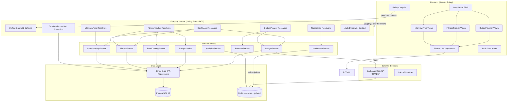
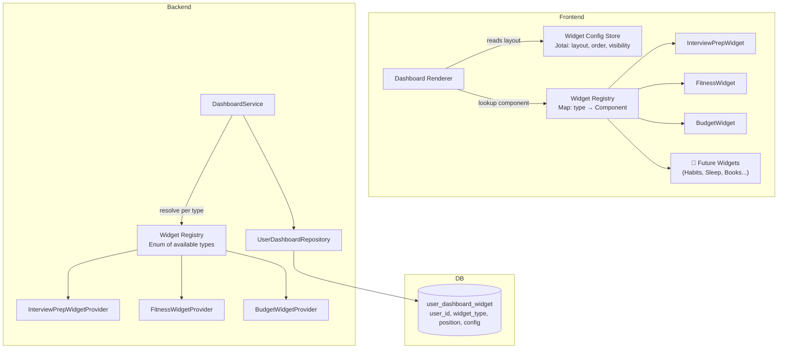
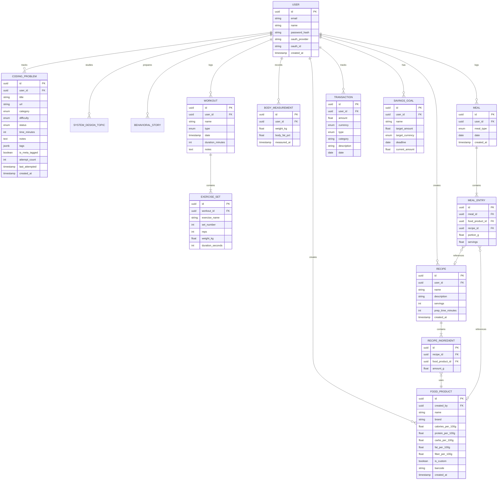
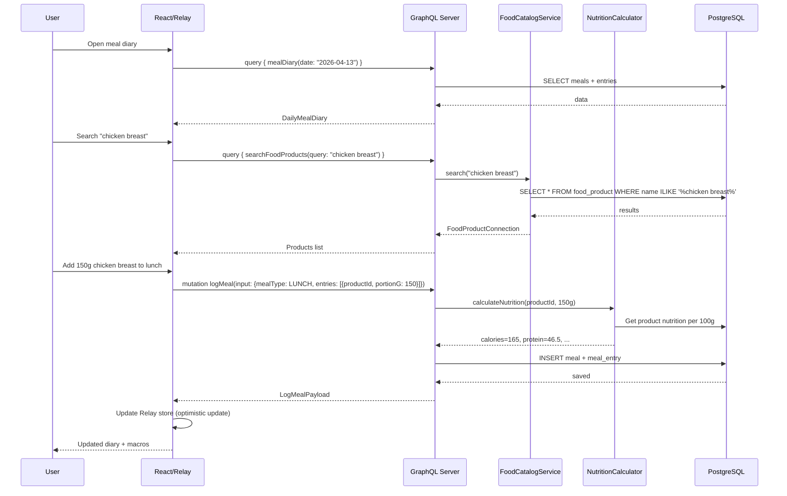
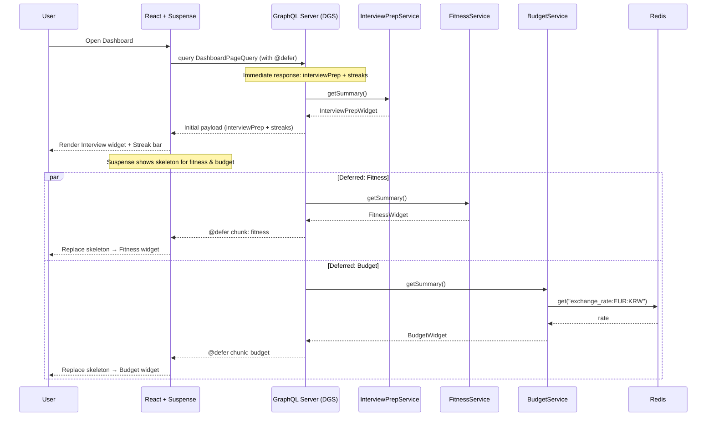
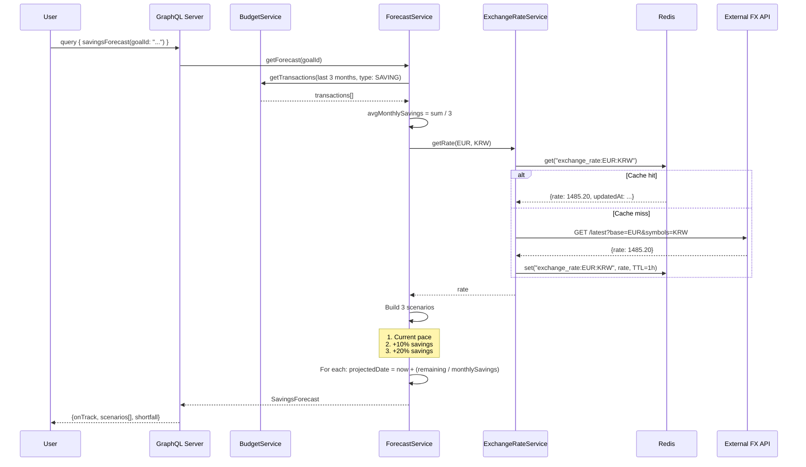
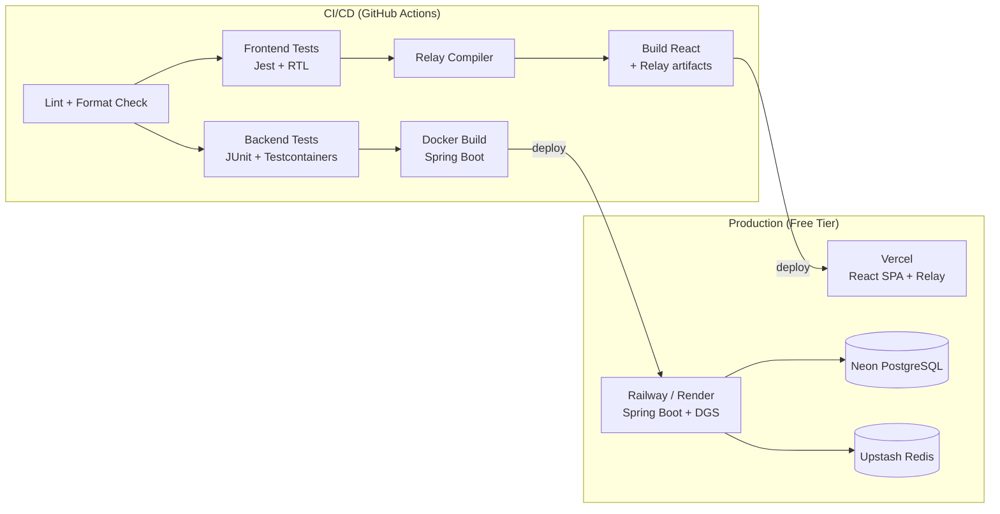

# Life Goals Dashboard — Architecture Design Document

**[🇬🇧 English](ARCHITECTURE.en.md)** · **[🇷🇺 Русский](ARCHITECTURE.md)**

---

> Author: mrurec | Date: April 2026
> Goal: Universal widget platform for tracking any life goals. Portfolio project for FAANG-level interviews.
> Stack: Kotlin/Spring Boot + GraphQL + React/Relay — chosen for maximum alignment with Meta engineering patterns

---

## 1. Project Overview

**Life Goals Dashboard** — a universal widget platform for tracking any life goals through a dynamic, configurable dashboard. The project is not tied to specific goals — each user chooses which widgets to add and configures them themselves. Architecture and code style are built to Meta Engineering standards.

### Built-in Widget Types

| Widget Type | Purpose | Key Features |
|-------------|---------|----------------|
| **Interview Prep** | Preparation for technical interviews (company and level in config) | LeetCode problem tracking, system design topics, behavioral STAR stories, weak area analytics |
| **Fitness Tracker** | Fitness tracking (goals in config) | Workouts, weight tracking, **product database and recipes**, meal diary with macros |
| **Budget Planner** | Savings for any goal (currencies, deadline in config) | Income/expenses, savings goal, forecast, exchange rate for configurable currency pair |

> **Example:** A user can add Interview Prep with `targetCompany: "Google"`, two Budget Planner widgets (one for vacation, one for emergency fund) with different currencies and deadlines, and Fitness Tracker — all on one dashboard.

---

## 2. Meta Engineering Principles Built Into the Project

Each principle below is what a Meta interviewer will appreciate when discussing the project.

### 2.1 GraphQL + Relay: Data Next to Component

Meta invented GraphQL and Relay. The project uses **Fragment Colocation** — each React component declares its own GraphQL fragment next to itself, not in a separate file. This guarantees that data and presentation never diverge.

### 2.2 Persisted Queries

In production, the client doesn't send the query text — only the hash (MD5) + variables. This reduces bandwidth, provides security (server-side allowlist of queries), and prevents arbitrary requests.

### 2.3 Cursor-based Pagination (Relay Connection Pattern)

Everywhere there are lists, the standard Relay Connection pattern is used: `edges → node + cursor`, `pageInfo { hasNextPage, endCursor }`. Never offset-based — this doesn't scale.

### 2.4 Privacy-Aware Data Access

Every data query includes viewer context. Permission checks are inline, not post-hoc. If the viewer doesn't have access, the query doesn't return data (rather than hiding rows after fetch).

### 2.5 React: Suspense + Error Boundaries

Async rendering is coordinated via Suspense (fallback UI while data loads). Error Boundary wraps Suspense to catch render errors. Together they provide graceful degradation.

### 2.6 Jotai for Global State

Meta doesn't use Redux. Jotai — atomic state, granular subscriptions, minimal boilerplate. Components subscribe only to the atoms they need. (Recoil — the previous option from Facebook — has been archived upstream and doesn't support React 19 concurrent rendering; Jotai is its conceptual successor with the same atom-based model.)

---

## 3. Requirements

### 3.1 Functional Requirements

**General:**
- Single dashboard with widgets from each module
- GraphQL API with Relay-compatible schema
- Notification system (in-app + GraphQL Subscriptions)
- Authentication (OAuth2 + JWT)
- Data export (CSV/PDF)

**Interview Prep:**
- CRUD problems with categories (Arrays, Trees, Graphs, DP, System Design, Behavioral)
- Difficulty and solve time assessment
- Problem tagging (meta-tagged, review, unsolved)
- Analytics: solved by category, average solve speed, heat map of activity
- Timer for practice

**Fitness Tracker:**
- Workout logging (exercise, sets, reps, weight)
- Body weight tracking with graph
- **Product database**: product catalog with nutrients (per 100g), search, custom products
- **Recipes**: composite dishes from multiple products, with automatic calorie/macro calculation
- Meal diary: linking products or finished recipes to meals, specifying portion
- Workout templates
- Progress relative to goals (target weight, workout frequency, calorie deficit)

**Budget Planner:**
- Income and expense tracking by category
- Savings goal with progress bar and custom deadline (configured in widget config)
- Forecast: can I save enough at current pace
- Exchange rate for currency pair specified in config (e.g., KRW/EUR) via external API (with Redis cache)
- Trip budget: flights, accommodation, food, entertainment — each line item in custom currency pair

### 3.2 Non-functional Requirements

| Parameter | Value | Rationale |
|----------|-------|-----------|
| Availability | 99.5% | Pet project, but should be reliable |
| Latency | < 200ms p95 for GraphQL queries | Pleasant UX, @defer for heavy fields |
| Scalability | 1 user → architecture for 10K | Demonstrates scaling thinking at interview |
| Security | OAuth2 + JWT, persisted queries allowlist | Financial data + Meta pattern |
| Deployment | Docker + CI/CD | DevOps skills |

---

## 4. High-Level Architecture

### 4.1 Architectural Style: Modular Monolith

**Why modular monolith, not microservices:**
- Single developer — infrastructure overhead not justified
- Shared database simplifies transactions between modules
- Clear module boundaries allow future service extraction

**Why not simple monolith:**
- Each module has its own package, GraphQL schema, and domain model
- Modules communicate through defined interfaces, not directly through each other's repositories
- Interview discussion point: evolution to services and federation

### 4.2 Component Diagram



### 4.3 Project Structure

#### Backend (Kotlin + Spring Boot + Netflix DGS)

```
apps/api/
├── src/main/kotlin/com/mrurec/lifegoals/
│   ├── LifeGoalsApplication.kt
│   ├── common/
│   │   ├── config/
│   │   │   ├── SecurityConfig.kt         # OAuth2 + JWT
│   │   │   ├── GraphQLConfig.kt          # DGS settings, persisted queries
│   │   │   ├── RedisConfig.kt
│   │   │   └── CorsConfig.kt
│   │   ├── auth/
│   │   │   ├── ViewerContext.kt           # Meta-style: viewer-aware context
│   │   │   ├── AuthDirective.kt           # @auth directive for schema
│   │   │   └── JwtTokenProvider.kt
│   │   ├── graphql/
│   │   │   ├── relay/
│   │   │   │   ├── Connection.kt          # Relay Connection types
│   │   │   │   ├── Edge.kt
│   │   │   │   ├── PageInfo.kt
│   │   │   │   └── CursorUtil.kt          # Cursor encode/decode
│   │   │   ├── DataLoaderRegistrar.kt     # N+1 prevention
│   │   │   └── ScalarTypes.kt             # DateTime, Money, etc.
│   │   ├── exception/
│   │   │   └── GraphQLExceptionHandler.kt
│   │   └── util/
│   │       ├── DateTimeUtil.kt
│   │       └── MoneyUtil.kt
│   │
│   ├── interviewprep/                     # Module 1
│   │   ├── model/
│   │   │   ├── CodingProblem.kt
│   │   │   ├── SystemDesignTopic.kt
│   │   │   └── BehavioralStory.kt
│   │   ├── repository/
│   │   │   ├── CodingProblemRepository.kt
│   │   │   ├── SystemDesignTopicRepository.kt
│   │   │   └── BehavioralStoryRepository.kt
│   │   ├── service/
│   │   │   ├── InterviewPrepService.kt
│   │   │   └── InterviewAnalyticsService.kt
│   │   └── graphql/
│   │       ├── InterviewPrepResolver.kt   # Queries
│   │       ├── InterviewPrepMutation.kt   # Mutations
│   │       └── InterviewPrepDataLoader.kt
│   │
│   ├── fitness/                           # Module 2
│   │   ├── model/
│   │   │   ├── Workout.kt
│   │   │   ├── ExerciseSet.kt
│   │   │   ├── BodyMeasurement.kt
│   │   │   ├── FoodProduct.kt            # Product from catalog
│   │   │   ├── Recipe.kt                 # Composite dish
│   │   │   ├── RecipeIngredient.kt       # Product + amount in recipe
│   │   │   ├── Meal.kt                   # Meal type
│   │   │   └── MealEntry.kt             # Entry: product or recipe + portion
│   │   ├── repository/
│   │   │   ├── WorkoutRepository.kt
│   │   │   ├── BodyMeasurementRepository.kt
│   │   │   ├── FoodProductRepository.kt
│   │   │   ├── RecipeRepository.kt
│   │   │   └── MealRepository.kt
│   │   ├── service/
│   │   │   ├── FitnessService.kt
│   │   │   ├── FoodCatalogService.kt     # CRUD + product search
│   │   │   ├── RecipeService.kt          # CRUD recipes with auto-calculation
│   │   │   └── NutritionCalculator.kt    # Calorie/macro calculation
│   │   └── graphql/
│   │       ├── FitnessResolver.kt
│   │       ├── FitnessMutation.kt
│   │       ├── FoodCatalogResolver.kt
│   │       ├── FoodCatalogMutation.kt
│   │       └── FitnessDataLoader.kt
│   │
│   ├── budget/                            # Module 3
│   │   ├── model/
│   │   │   ├── Transaction.kt
│   │   │   ├── SavingsGoal.kt
│   │   │   └── TripBudgetItem.kt
│   │   ├── repository/
│   │   │   ├── TransactionRepository.kt
│   │   │   ├── SavingsGoalRepository.kt
│   │   │   └── TripBudgetItemRepository.kt
│   │   ├── service/
│   │   │   ├── BudgetService.kt
│   │   │   ├── ForecastService.kt
│   │   │   └── ExchangeRateService.kt    # Exchange rates (configurable pairs) with Redis cache
│   │   └── graphql/
│   │       ├── BudgetResolver.kt
│   │       ├── BudgetMutation.kt
│   │       └── BudgetDataLoader.kt
│   │
│   ├── dashboard/                         # Aggregation layer
│   │   ├── service/
│   │   │   └── DashboardService.kt
│   │   └── graphql/
│   │       └── DashboardResolver.kt
│   │
│   └── notification/
│       ├── model/
│       │   └── Notification.kt
│       ├── service/
│       │   ├── NotificationService.kt
│       │   └── AchievementChecker.kt
│       └── graphql/
│           ├── NotificationResolver.kt
│           └── NotificationSubscription.kt  # GraphQL Subscriptions via WebSocket
│
├── src/main/resources/
│   ├── schema/                            # GraphQL schema files
│   │   ├── schema.graphqls               # Root Query, Mutation, Subscription
│   │   ├── relay.graphqls                # Node interface, Connection types
│   │   ├── interviewprep.graphqls
│   │   ├── fitness.graphqls
│   │   ├── food.graphqls                 # Products + Recipes schema
│   │   ├── budget.graphqls
│   │   ├── dashboard.graphqls
│   │   └── notification.graphqls
│   ├── db/migration/                      # Flyway migrations
│   └── application.yml
│
└── src/test/kotlin/com/mrurec/lifegoals/  # Tests colocated by module
    ├── interviewprep/
    ├── fitness/
    ├── budget/
    └── common/
```

#### Frontend — Monorepo (npm workspaces)

The project is structured as an npm workspace monorepo to support web and future mobile without changing existing configs.

```
life-goals-dashboard/              # root npm workspace
│
├── packages/
│   └── shared/                    # @life-goals/shared — cross-platform code
│       ├── schema.graphql         # Single source of truth for all relay.config.json
│       ├── package.json
│       ├── tsconfig.json
│       └── src/
│           ├── relay/             # Base network layer (fetch logic, no platform deps)
│           ├── store/             # Jotai atoms: themeAtom, userAtom, notificationsAtom
│           ├── hooks/             # Platform-agnostic hooks: useDebounce, usePersistedCallback
│           └── types/             # Shared TypeScript domain interfaces
│
├── apps/web/                      # React + Vite web app
│   ├── relay.config.json          # schema: "../packages/shared/schema.graphql"
│   ├── src/
│   │   ├── index.tsx
│   │   ├── App.tsx
│   │   ├── relay/
│   │   │   ├── RelayEnvironment.ts      # Relay network + store config (web transport)
│   │   │   └── persistedQueries.json   # Hash → query mapping
│   │   │
│   │   ├── components/                  # Web UI components (CSS Modules)
│   │   │   ├── Button/
│   │   │   │   ├── Button.tsx
│   │   │   │   ├── Button.module.css
│   │   │   │   └── Button.test.tsx      # Colocated test (Meta pattern)
│   │   │   ├── Card/
│   │   │   ├── ProgressBar/
│   │   │   ├── Chart/
│   │   │   ├── ErrorBoundary.tsx
│   │   │   └── SuspenseFallback.tsx
│   │   │
│   │   ├── features/
│   │   │   ├── dashboard/
│   │   │   │   ├── DashboardPage.tsx
│   │   │   │   ├── DashboardPage.test.tsx
│   │   │   │   ├── widgets/
│   │   │   │   │   ├── InterviewWidget.tsx   # Contains its own GraphQL fragment
│   │   │   │   │   ├── FitnessWidget.tsx
│   │   │   │   │   └── BudgetWidget.tsx
│   │   │   │   └── __generated__/            # Relay compiler output
│   │   │   │
│   │   │   ├── interviewPrep/
│   │   │   │   ├── ProblemList.tsx           # Fragment: ProblemList_problems
│   │   │   │   ├── ProblemDetail.tsx         # Fragment: ProblemDetail_problem
│   │   │   │   ├── ProblemForm.tsx
│   │   │   │   ├── StatsHeatMap.tsx
│   │   │   │   ├── WeakAreasChart.tsx
│   │   │   │   ├── Timer.tsx
│   │   │   │   └── __generated__/
│   │   │   │
│   │   │   ├── fitness/
│   │   │   │   ├── WorkoutLog.tsx
│   │   │   │   ├── WorkoutForm.tsx
│   │   │   │   ├── BodyProgress.tsx
│   │   │   │   ├── food/                     # Food sub-feature
│   │   │   │   │   ├── FoodSearch.tsx        # Product search
│   │   │   │   │   ├── FoodProductCard.tsx   # Fragment: FoodProductCard_product
│   │   │   │   │   ├── AddCustomFood.tsx
│   │   │   │   │   ├── RecipeBuilder.tsx     # Recipe constructor
│   │   │   │   │   ├── RecipeCard.tsx
│   │   │   │   │   └── __generated__/
│   │   │   │   ├── meals/
│   │   │   │   │   ├── MealDiary.tsx         # Meal diary
│   │   │   │   │   ├── MealEntry.tsx
│   │   │   │   │   ├── DailySummary.tsx      # Calorie/macro summary for day
│   │   │   │   │   └── __generated__/
│   │   │   │   └── __generated__/
│   │   │   │
│   │   │   └── budget/
│   │   │       ├── TransactionList.tsx
│   │   │       ├── TransactionForm.tsx
│   │   │       ├── SavingsProgress.tsx
│   │   │       ├── ForecastChart.tsx
│   │   │       ├── ExchangeRateWidget.tsx    # Exchange rate display (configured currency pair)
│   │   │       ├── BudgetBreakdown.tsx       # Budget breakdown for savings goal (configurable)
│   │   │       └── __generated__/
│   │   │
│   │   └── __generated__/               # Relay compiler output (root-level)
│   │
│   ├── package.json                     # dep: "@life-goals/shared": "*"
│   ├── vite.config.ts
│   └── tsconfig.json
│
└── apps/mobile/                         # [PLANNED] React Native app
    ├── relay.config.json                # schema: "../packages/shared/schema.graphql"
    ├── src/                             # RN components (View/Text/StyleSheet)
    └── README.md
```

**Rule:** Platform-specific code (CSS Modules, DOM APIs, StyleSheet, Metro config) lives in the platform package. Cross-platform logic goes in `packages/shared`.

---

## 5. Widget System — Pluggable Dashboard Architecture

The dashboard is not a fixed page with three widgets, but a **dynamic panel** where users add and remove widgets. Interview Prep, Fitness, and Budget are just the first three widgets in a growing catalog. New widgets (habits, sleep, books, language) connect without core changes.

### 5.1 Widget Registry Architecture



### 5.2 Backend: WidgetProvider Interface (Open-Closed Principle)

Each new widget implements one interface. Registration is through Spring autowiring.

```kotlin
// common/widget/WidgetProvider.kt

interface WidgetProvider {
    /** Unique type identifier */
    val type: WidgetType

    /** Display metadata for the widget catalog */
    val metadata: WidgetMetadata

    /** JSON schema for this widget's configuration */
    val configSchema: JsonSchema

    /**
     * Validate widget config against schema.
     * Returns a list of validation errors (empty if valid).
     */
    fun validateConfig(config: JsonNode): List<ConfigError>

    /**
     * Resolve widget data for a given viewer.
     * Returns a GraphQL-serializable object.
     * Each provider returns its own type — the GraphQL union handles polymorphism.
     * Config is required — all domain-specific parameters come from config, not hardcoded.
     */
    fun resolve(viewerContext: ViewerContext, config: JsonNode): Any
}

data class WidgetMetadata(
    val displayName: String,
    val description: String,
    val icon: String,
    val defaultConfig: JsonNode? = null
)

enum class WidgetType {
    INTERVIEW_PREP,
    FITNESS,
    BUDGET,
    // Future:
    // HABITS,
    // SLEEP_TRACKER,
    // BOOK_LIST,
    // LANGUAGE_LEARNING
}

// interviewprep/widget/InterviewPrepWidgetProvider.kt
@Component
class InterviewPrepWidgetProvider(
    private val interviewPrepService: InterviewPrepService
) : WidgetProvider {

    override val type = WidgetType.INTERVIEW_PREP

    override val metadata = WidgetMetadata(
        displayName = "Interview Prep",
        description = "Track LeetCode problems, system design topics, and behavioral stories",
        icon = "code"
    )

    override val configSchema = JsonSchema("""
    {
        "type": "object",
        "properties": {
            "targetCompany": { "type": "string", "description": "Target company name (e.g., Meta, Google)" },
            "focusAreas": { "type": "array", "items": { "type": "string" } },
            "deadline": { "type": "string", "format": "date" }
        },
        "required": ["targetCompany"]
    }
    """.trimIndent())

    override fun validateConfig(config: JsonNode): List<ConfigError> {
        val errors = mutableListOf<ConfigError>()
        if (!config.has("targetCompany")) {
            errors.add(ConfigError("targetCompany", "Required field"))
        }
        return errors
    }

    override fun resolve(viewerContext: ViewerContext, config: JsonNode): InterviewPrepWidgetData {
        val targetCompany = config["targetCompany"].asText()
        return interviewPrepService.getWidgetSummary(viewerContext.userId, targetCompany)
    }
}
```

### 5.3 Widget Registry (auto-discovery)

```kotlin
// common/widget/WidgetRegistry.kt

@Component
class WidgetRegistry(providers: List<WidgetProvider>) {

    private val registry: Map<WidgetType, WidgetProvider> =
        providers.associateBy { it.type }

    fun getProvider(type: WidgetType): WidgetProvider =
        registry[type] ?: throw WidgetNotFoundException(type)

    fun getAvailableWidgets(): List<WidgetMetadata> =
        registry.values.map { it.metadata }

    fun resolve(type: WidgetType, viewer: ViewerContext, config: JsonNode): Any {
        val provider = getProvider(type)
        val errors = provider.validateConfig(config)
        if (errors.isNotEmpty()) {
            throw InvalidWidgetConfigException(type, errors)
        }
        return provider.resolve(viewer, config)
    }
}
```

### 5.4 User Dashboard Configuration (DB)

```sql
-- Flyway: V5__create_user_dashboard.sql

CREATE TABLE user_dashboard_widget (
    id          UUID PRIMARY KEY DEFAULT gen_random_uuid(),
    user_id     UUID NOT NULL REFERENCES "user"(id),
    widget_type VARCHAR(50) NOT NULL,        -- 'INTERVIEW_PREP', 'FITNESS', etc.
    position    INT NOT NULL DEFAULT 0,       -- Order on dashboard
    size        VARCHAR(10) DEFAULT 'MEDIUM', -- 'SMALL', 'MEDIUM', 'LARGE'
    config      JSONB NOT NULL,               -- Widget-specific user config (required; e.g., target weight, deadline, currency pair)
    is_visible  BOOLEAN DEFAULT true,
    created_at  TIMESTAMP DEFAULT NOW(),

    UNIQUE (user_id, widget_type)             -- One instance per type per user
);

CREATE INDEX idx_user_dashboard_user ON user_dashboard_widget(user_id, position);
```

### 5.5 Frontend: Dynamic Widget Rendering

```tsx
// features/dashboard/WidgetRegistry.ts

import { lazy, ComponentType } from 'react';

// Lazy-loaded widget components — only load what user has enabled
const widgetComponents: Record<string, () => Promise<{ default: ComponentType<any> }>> = {
  INTERVIEW_PREP: () => import('./widgets/InterviewPrepWidget'),
  FITNESS: () => import('./widgets/FitnessWidget'),
  BUDGET: () => import('./widgets/BudgetWidget'),
  // Future widgets register here — zero changes to Dashboard code
  // HABITS: () => import('./widgets/HabitsWidget'),
  // SLEEP_TRACKER: () => import('./widgets/SleepTrackerWidget'),
};

export function getWidgetComponent(type: string): ComponentType<any> | null {
  const loader = widgetComponents[type];
  if (!loader) return null;
  return lazy(loader);
}

export function getAvailableWidgetTypes(): string[] {
  return Object.keys(widgetComponents);
}
```

```tsx
// features/dashboard/DashboardPage.tsx

import { Suspense } from 'react';
import { useLazyLoadQuery, useMutation } from 'react-relay';
import { graphql } from 'relay-runtime';
import ErrorBoundary from '../../components/ErrorBoundary';
import { getWidgetComponent } from './WidgetRegistry';

const dashboardQuery = graphql`
  query DashboardPageQuery {
    myDashboard {
      widgets {
        id
        type
        position
        size
        config
        data {
          __typename
          ... on InterviewPrepWidgetData { ...InterviewPrepWidget_data }
          ... on FitnessWidgetData { ...FitnessWidget_data }
          ... on BudgetWidgetData { ...BudgetWidget_data }
        }
      }
    }
    availableWidgets {
      type
      displayName
      description
      icon
    }
  }
`;

export default function DashboardPage() {
  const { myDashboard, availableWidgets } = useLazyLoadQuery(dashboardQuery, {});

  return (
    <div className="dashboard">
      <div className="dashboard__grid">
        {myDashboard.widgets
          .sort((a, b) => a.position - b.position)
          .map(widget => {
            const WidgetComponent = getWidgetComponent(widget.type);
            if (!WidgetComponent) return null;

            return (
              <ErrorBoundary key={widget.id} fallback={<WidgetError type={widget.type} />}>
                <Suspense fallback={<WidgetSkeleton size={widget.size} />}>
                  <WidgetComponent data={widget.data} config={widget.config} />
                </Suspense>
              </ErrorBoundary>
            );
          })
        }
      </div>

      <AddWidgetButton availableWidgets={availableWidgets} />
    </div>
  );
}
```

### 5.6 How to Add a New Widget (DX in 3 Steps)

For example, adding a **Sleep Tracker** widget:

**Step 1. Backend** — create `SleepWidgetProvider implements WidgetProvider` and models. Spring autodiscovery will pick it up in `WidgetRegistry`.

**Step 2. GraphQL Schema** — add `SleepWidgetData` to `WidgetData` union and write a fragment.

**Step 3. Frontend** — create `SleepWidget.tsx` with a fragment and register in `widgetComponents` map (one line).

Nothing else needs to change. Dashboard, resolvers, routing — everything works automatically. This is **Open-Closed Principle** in action.

### 5.7 Interview Topics from Widget System

1. **"Design a plugin/widget system"** — direct hit. Discuss: registry pattern, lazy loading, schema evolution (union vs interface)
2. **"How would you extend this?"** — "Adding a widget = 1 provider + 1 component + 1 schema type. Zero core changes."
3. **"How do you handle N widget types in GraphQL?"** — Union type `WidgetData` + `__typename` for dispatch. Trade-off: union requires explicit type listing vs interface allows open set but loses type safety.

---

## 6. GraphQL Schema

### 6.1 Core Types & Relay Interface

```graphql
# schema.graphqls — Root types

interface Node {
  id: ID!
}

type PageInfo {
  hasNextPage: Boolean!
  hasPreviousPage: Boolean!
  startCursor: String
  endCursor: String
}

type Query {
  # Relay node interface — resolve any entity by global ID
  node(id: ID!): Node

  # Dashboard — dynamic widget system
  myDashboard: MyDashboard!
  availableWidgets: [AvailableWidget!]!

  # Interview Prep
  problems(
    first: Int
    after: String
    filter: ProblemFilter
  ): CodingProblemConnection!
  problem(id: ID!): CodingProblem
  interviewStats: InterviewStats!
  problemHeatMap(days: Int = 90): [HeatMapEntry!]!
  weakAreas: [WeakArea!]!

  systemDesignTopics: [SystemDesignTopic!]!
  behavioralStories: [BehavioralStory!]!

  # Fitness
  workouts(first: Int, after: String): WorkoutConnection!
  workout(id: ID!): Workout
  bodyMeasurements(first: Int, after: String): BodyMeasurementConnection!
  bodyProgress: BodyProgress!
  fitnessStats: FitnessStats!

  # Food & Recipes
  searchFoodProducts(query: String!, first: Int = 20): FoodProductConnection!
  foodProduct(id: ID!): FoodProduct
  myRecipes(first: Int, after: String): RecipeConnection!
  recipe(id: ID!): Recipe

  # Meals
  mealDiary(date: Date!): DailyMealDiary!
  dailyNutritionSummary(date: Date!): NutritionSummary!
  weeklyNutritionSummary: WeeklyNutritionSummary!

  # Budget
  transactions(
    first: Int
    after: String
    filter: TransactionFilter
  ): TransactionConnection!
  transactionSummary(period: Period!): TransactionSummary!
  savingsGoals: [SavingsGoal!]!
  savingsForecast(goalId: ID!): SavingsForecast!
  exchangeRate(from: Currency!, to: Currency!): ExchangeRate!
  savingGoalBudget: TripBudget!  # Budget breakdown for active savings goal (configured per widget)

  # Notifications
  notifications(first: Int, after: String, unreadOnly: Boolean): NotificationConnection!
}

type Mutation {
  # Interview Prep
  createProblem(input: CreateProblemInput!): CreateProblemPayload!
  updateProblem(input: UpdateProblemInput!): UpdateProblemPayload!
  deleteProblem(id: ID!): DeleteProblemPayload!
  logProblemAttempt(input: LogAttemptInput!): LogAttemptPayload!

  createSystemDesignTopic(input: CreateSystemDesignTopicInput!): CreateSystemDesignTopicPayload!
  updateSystemDesignTopic(input: UpdateSystemDesignTopicInput!): UpdateSystemDesignTopicPayload!

  createBehavioralStory(input: CreateBehavioralStoryInput!): CreateBehavioralStoryPayload!
  updateBehavioralStory(input: UpdateBehavioralStoryInput!): UpdateBehavioralStoryPayload!

  # Fitness
  logWorkout(input: LogWorkoutInput!): LogWorkoutPayload!
  updateWorkout(input: UpdateWorkoutInput!): UpdateWorkoutPayload!
  deleteWorkout(id: ID!): DeleteWorkoutPayload!

  recordBodyMeasurement(input: RecordBodyMeasurementInput!): RecordBodyMeasurementPayload!

  # Food & Recipes
  createFoodProduct(input: CreateFoodProductInput!): CreateFoodProductPayload!
  updateFoodProduct(input: UpdateFoodProductInput!): UpdateFoodProductPayload!
  createRecipe(input: CreateRecipeInput!): CreateRecipePayload!
  updateRecipe(input: UpdateRecipeInput!): UpdateRecipePayload!
  deleteRecipe(id: ID!): DeleteRecipePayload!

  # Meals
  logMeal(input: LogMealInput!): LogMealPayload!
  updateMealEntry(input: UpdateMealEntryInput!): UpdateMealEntryPayload!
  deleteMealEntry(id: ID!): DeleteMealEntryPayload!

  # Budget
  createTransaction(input: CreateTransactionInput!): CreateTransactionPayload!
  updateTransaction(input: UpdateTransactionInput!): UpdateTransactionPayload!
  deleteTransaction(id: ID!): DeleteTransactionPayload!
  createSavingsGoal(input: CreateSavingsGoalInput!): CreateSavingsGoalPayload!
  updateSavingsGoal(input: UpdateSavingsGoalInput!): UpdateSavingsGoalPayload!
  updateTripBudget(input: UpdateTripBudgetInput!): UpdateTripBudgetPayload!

  # Notifications
  markNotificationRead(id: ID!): MarkNotificationReadPayload!
  markAllNotificationsRead: MarkAllNotificationsReadPayload!
}

type Subscription {
  notificationReceived: Notification!
  exchangeRateUpdated(from: Currency!, to: Currency!): ExchangeRate!
}
```

### 6.2 Interview Prep Types

```graphql
# interviewprep.graphqls

type CodingProblem implements Node {
  id: ID!
  title: String!
  url: String
  category: ProblemCategory!
  difficulty: Difficulty!
  status: ProblemStatus!
  timeMinutes: Int
  notes: String
  tags: [String!]!
  isMetaTagged: Boolean!
  attemptCount: Int!
  lastAttempted: DateTime
  createdAt: DateTime!
}

type CodingProblemConnection {
  edges: [CodingProblemEdge!]!
  pageInfo: PageInfo!
  totalCount: Int!
}

type CodingProblemEdge {
  node: CodingProblem!
  cursor: String!
}

enum ProblemCategory {
  ARRAY
  STRING
  LINKED_LIST
  TREE
  GRAPH
  DYNAMIC_PROGRAMMING
  BINARY_SEARCH
  BACKTRACKING
  SYSTEM_DESIGN
  OTHER
}

enum Difficulty { EASY MEDIUM HARD }
enum ProblemStatus { TODO ATTEMPTED SOLVED REVIEW }

input ProblemFilter {
  category: ProblemCategory
  difficulty: Difficulty
  status: ProblemStatus
  isMetaTagged: Boolean
  searchQuery: String
}

input CreateProblemInput {
  title: String!
  url: String
  category: ProblemCategory!
  difficulty: Difficulty!
  timeMinutes: Int
  notes: String
  tags: [String!]
  isMetaTagged: Boolean = false
}

# Meta pattern: every mutation returns a Payload with the mutated object
type CreateProblemPayload {
  problem: CodingProblem!
}

input LogAttemptInput {
  problemId: ID!
  timeMinutes: Int!
  solved: Boolean!
  notes: String
}

type LogAttemptPayload {
  problem: CodingProblem!
}

type InterviewStats {
  totalProblems: Int!
  solvedCount: Int!
  attemptedCount: Int!
  solvedByCategory: [CategoryCount!]!
  solvedByDifficulty: [DifficultyCount!]!
  averageSolveTimeMinutes: Float
  streakDays: Int!
  metaTaggedSolved: Int!
  metaTaggedTotal: Int!
  readinessScore: Float!   # 0-100, heuristic
}

type CategoryCount {
  category: ProblemCategory!
  solved: Int!
  total: Int!
  percentage: Float!
}

type HeatMapEntry {
  date: Date!
  count: Int!
}

type WeakArea {
  category: ProblemCategory!
  solvedPercentage: Float!
  recommendation: String!
}

type SystemDesignTopic implements Node {
  id: ID!
  title: String!
  status: StudyStatus!
  keyPoints: String
  notes: String
  resources: [String!]!
  lastReviewed: DateTime
}

enum StudyStatus { NOT_STARTED IN_PROGRESS REVIEWED MASTERED }

type BehavioralStory implements Node {
  id: ID!
  situation: String!
  task: String!
  action: String!
  result: String!
  applicableQuestions: [String!]!
  confidence: Confidence!
}

enum Confidence { LOW MEDIUM HIGH }
```

### 6.3 Fitness & Food Types

```graphql
# fitness.graphqls

type Workout implements Node {
  id: ID!
  name: String!
  type: WorkoutType!
  date: DateTime!
  durationMinutes: Int!
  exerciseSets: [ExerciseSet!]!
  notes: String
  totalVolume: Float            # Computed: sum(sets * reps * weight)
}

type WorkoutConnection {
  edges: [WorkoutEdge!]!
  pageInfo: PageInfo!
  totalCount: Int!
}

type WorkoutEdge {
  node: Workout!
  cursor: String!
}

enum WorkoutType { STRENGTH CARDIO FLEXIBILITY MIXED }

type ExerciseSet {
  exerciseName: String!
  setNumber: Int!
  reps: Int
  weightKg: Float
  durationSeconds: Int
}

type BodyMeasurement implements Node {
  id: ID!
  weightKg: Float!
  bodyFatPct: Float
  waistCm: Float
  chestCm: Float
  armCm: Float
  measuredAt: DateTime!
}

type BodyMeasurementConnection {
  edges: [BodyMeasurementEdge!]!
  pageInfo: PageInfo!
}

type BodyMeasurementEdge {
  node: BodyMeasurement!
  cursor: String!
}

type BodyProgress {
  currentWeight: Float!
  targetWeight: Float!
  startWeight: Float!
  weightChange: Float!          # Negative = lost weight
  trend: TrendDirection!
  measurements: [BodyMeasurement!]!  # Last 30 entries for chart
}

enum TrendDirection { UP DOWN STABLE }

type FitnessStats {
  workoutsThisWeek: Int!
  targetWorkoutsPerWeek: Int!
  avgDailyCalories: Float
  calorieTarget: Float
  currentWeight: Float!
  weightTrend: TrendDirection!
  streakDays: Int!
}

# food.graphqls — Products & Recipes

type FoodProduct implements Node {
  id: ID!
  name: String!
  brand: String
  # Nutrition per 100g
  caloriesPer100g: Float!
  proteinPer100g: Float!
  carbsPer100g: Float!
  fatPer100g: Float!
  fiberPer100g: Float
  # Meta
  isCustom: Boolean!            # User-created vs from catalog
  barcode: String
  createdBy: ID
}

type FoodProductConnection {
  edges: [FoodProductEdge!]!
  pageInfo: PageInfo!
  totalCount: Int!
}

type FoodProductEdge {
  node: FoodProduct!
  cursor: String!
}

input CreateFoodProductInput {
  name: String!
  brand: String
  caloriesPer100g: Float!
  proteinPer100g: Float!
  carbsPer100g: Float!
  fatPer100g: Float!
  fiberPer100g: Float
  barcode: String
}

type Recipe implements Node {
  id: ID!
  name: String!
  description: String
  ingredients: [RecipeIngredient!]!
  totalWeightG: Float!          # Computed: sum of ingredient weights
  servings: Int!
  # Computed nutrition (per serving)
  caloriesPerServing: Float!
  proteinPerServing: Float!
  carbsPerServing: Float!
  fatPerServing: Float!
  # Computed nutrition (total)
  totalCalories: Float!
  prepTimeMinutes: Int
  createdAt: DateTime!
}

type RecipeConnection {
  edges: [RecipeEdge!]!
  pageInfo: PageInfo!
}

type RecipeEdge {
  node: Recipe!
  cursor: String!
}

type RecipeIngredient {
  product: FoodProduct!
  amountG: Float!
  # Computed from product nutrition * amount
  calories: Float!
  protein: Float!
  carbs: Float!
  fat: Float!
}

input CreateRecipeInput {
  name: String!
  description: String
  ingredients: [RecipeIngredientInput!]!
  servings: Int! = 1
  prepTimeMinutes: Int
}

input RecipeIngredientInput {
  productId: ID!
  amountG: Float!
}

# Meal diary

type DailyMealDiary {
  date: Date!
  meals: [Meal!]!
  totals: NutritionSummary!
}

type Meal implements Node {
  id: ID!
  mealType: MealType!
  date: DateTime!
  entries: [MealEntry!]!
  totalCalories: Float!
  totalProtein: Float!
  totalCarbs: Float!
  totalFat: Float!
}

enum MealType { BREAKFAST LUNCH DINNER SNACK }

type MealEntry implements Node {
  id: ID!
  # Union-like: either a product or a recipe
  foodProduct: FoodProduct
  recipe: Recipe
  portionG: Float             # Weight in grams (for products)
  servings: Float             # Number of servings (for recipes)
  # Computed
  calories: Float!
  protein: Float!
  carbs: Float!
  fat: Float!
}

input LogMealInput {
  mealType: MealType!
  date: Date!
  entries: [MealEntryInput!]!
}

input MealEntryInput {
  foodProductId: ID
  recipeId: ID
  portionG: Float
  servings: Float
}

type NutritionSummary {
  calories: Float!
  protein: Float!
  carbs: Float!
  fat: Float!
  fiber: Float
  calorieTarget: Float
  proteinTarget: Float
  carbsTarget: Float
  fatTarget: Float
  isOnTarget: Boolean!
}

type WeeklyNutritionSummary {
  days: [DailyNutritionEntry!]!
  averageCalories: Float!
  averageProtein: Float!
  averageCarbs: Float!
  averageFat: Float!
}

type DailyNutritionEntry {
  date: Date!
  calories: Float!
  protein: Float!
  carbs: Float!
  fat: Float!
}
```

### 6.4 Budget Types

```graphql
# budget.graphqls

type Transaction implements Node {
  id: ID!
  amount: Float!
  currency: Currency!
  type: TransactionType!
  category: String!
  description: String
  date: DateTime!
}

type TransactionConnection {
  edges: [TransactionEdge!]!
  pageInfo: PageInfo!
  totalCount: Int!
}

type TransactionEdge {
  node: Transaction!
  cursor: String!
}

enum TransactionType { INCOME EXPENSE SAVING }
enum Currency { EUR KRW USD RUB }

input TransactionFilter {
  type: TransactionType
  category: String
  dateFrom: Date
  dateTo: Date
  minAmount: Float
  maxAmount: Float
}

input CreateTransactionInput {
  amount: Float!
  currency: Currency!
  type: TransactionType!
  category: String!
  description: String
  date: Date!
}

type TransactionSummary {
  period: Period!
  totalIncome: Float!
  totalExpenses: Float!
  totalSavings: Float!
  netAmount: Float!
  byCategory: [CategoryAmount!]!
}

type CategoryAmount {
  category: String!
  amount: Float!
  percentage: Float!
}

enum Period { WEEK MONTH QUARTER YEAR }

type SavingsGoal implements Node {
  id: ID!
  name: String!
  targetAmount: Float!
  targetCurrency: Currency!
  currentAmount: Float!
  deadline: Date!
  progressPercentage: Float!
  onTrack: Boolean!
}

type SavingsForecast {
  goal: SavingsGoal!
  avgMonthlySavings: Float!
  projectedReachDate: Date
  onTrack: Boolean!
  shortfall: Float             # How much more needed if not on track
  scenarios: [ForecastScenario!]!
}

type ForecastScenario {
  name: String!                 # "Current pace", "10% more", "20% more"
  monthlySavings: Float!
  reachDate: Date
  onTrack: Boolean!
}

type ExchangeRate {
  from: Currency!
  to: Currency!
  rate: Float!
  updatedAt: DateTime!
}

type TripBudget {
  totalEur: Float!
  totalKrw: Float!
  items: [TripBudgetItem!]!
  currentRate: ExchangeRate!
  funded: Float!                # How much already saved
  remaining: Float!
}

type TripBudgetItem {
  id: ID!
  name: String!                 # "Flights", "Accommodation", "Food", etc.
  estimatedEur: Float!
  estimatedKrw: Float!          # Auto-converted at current rate
}
```

### 6.5 Dashboard & Notification Types

```graphql
# dashboard.graphqls — Dynamic Widget System

# User's configured dashboard
type MyDashboard {
  widgets: [DashboardWidget!]!
}

# A placed widget on the user's dashboard
type DashboardWidget implements Node {
  id: ID!
  type: WidgetType!
  position: Int!
  size: WidgetSize!
  config: JSON
  data: WidgetData! @defer     # Each widget data loads independently via @defer
}

enum WidgetType {
  INTERVIEW_PREP
  FITNESS
  BUDGET
  # Future: HABITS, SLEEP_TRACKER, BOOK_LIST, LANGUAGE_LEARNING
}

enum WidgetSize { SMALL MEDIUM LARGE }

# Union: each widget resolves its own data shape
union WidgetData =
  InterviewPrepWidgetData |
  FitnessWidgetData |
  BudgetWidgetData
  # Future types added here — clients use __typename to dispatch

# Widget catalog (what's available to add)
type AvailableWidget {
  type: WidgetType!
  displayName: String!
  description: String!
  icon: String!
}

type InterviewPrepWidgetData {
  solvedToday: Int!
  solvedThisWeek: Int!
  totalSolved: Int!
  weakestCategory: ProblemCategory
  readinessScore: Float!
  nextReviewProblem: CodingProblem   # Spaced repetition suggestion
}

type FitnessWidgetData {
  currentWeight: Float!
  weightTrend: TrendDirection!
  workoutsThisWeek: Int!
  todayCalories: Float
  todayCalorieTarget: Float
  lastWorkout: Workout
}

type BudgetWidgetData {
  savingsProgress: Float!       # Percentage toward goal (config-driven)
  monthlyBurnRate: Float!
  currentExchangeRate: Float!   # Exchange rate for configured currency pair (e.g., KRW/EUR)
  onTrack: Boolean!
  daysUntilDeadline: Int!       # Days until user-configured deadline
}

# Mutations for dashboard management
extend type Mutation {
  addWidgetToDashboard(input: AddWidgetInput!): AddWidgetPayload!
  removeWidgetFromDashboard(widgetId: ID!): RemoveWidgetPayload!
  reorderWidgets(input: ReorderWidgetsInput!): ReorderWidgetsPayload!
  updateWidgetConfig(input: UpdateWidgetConfigInput!): UpdateWidgetConfigPayload!
}

input AddWidgetInput {
  type: WidgetType!
  position: Int
  size: WidgetSize = MEDIUM
  config: JSON!                  # Widget-specific config (required; validated against widget's configSchema)
}

type AddWidgetPayload {
  widget: DashboardWidget
  errors: [UserError!]!
}

input ReorderWidgetsInput {
  widgetIds: [ID!]!             # Ordered list — position = index
}

type ReorderWidgetsPayload {
  dashboard: MyDashboard
  errors: [UserError!]!
}

type Streaks {
  coding: Int!                  # Days in a row solving problems
  workout: Int!                 # Days in a row logging workouts
  mealLogging: Int!             # Days in a row logging all meals
  budgetTracking: Int!          # Days in a row logging expenses
}

# notification.graphqls

type Notification implements Node {
  id: ID!
  title: String!
  message: String!
  type: NotificationType!
  isRead: Boolean!
  createdAt: DateTime!
  # Link to related entity
  relatedEntityId: ID
  relatedEntityType: String
}

enum NotificationType { REMINDER ACHIEVEMENT WARNING MILESTONE }

type NotificationConnection {
  edges: [NotificationEdge!]!
  pageInfo: PageInfo!
  unreadCount: Int!
}

type NotificationEdge {
  node: Notification!
  cursor: String!
}
```

---

## 7. Fragment Colocation (Meta Pattern)

This is the key pattern — each React component declares its data next to itself.

### Example: FoodProductCard

```tsx
// features/fitness/food/FoodProductCard.tsx

import { useFragment } from 'react-relay';
import { graphql } from 'relay-runtime';
import type { FoodProductCard_product$key } from './__generated__/FoodProductCard_product.graphql';

// Fragment colocated with component — Meta pattern
const foodProductFragment = graphql`
  fragment FoodProductCard_product on FoodProduct {
    id
    name
    brand
    caloriesPer100g
    proteinPer100g
    carbsPer100g
    fatPer100g
    isCustom
  }
`;

interface Props {
  product: FoodProductCard_product$key;
  onSelect?: (id: string) => void;
}

export default function FoodProductCard({ product, onSelect }: Props) {
  const data = useFragment(foodProductFragment, product);

  return (
    <div className="food-product-card" onClick={() => onSelect?.(data.id)}>
      <div className="food-product-card__header">
        <span className="food-product-card__name">{data.name}</span>
        {data.brand && (
          <span className="food-product-card__brand">{data.brand}</span>
        )}
        {data.isCustom && (
          <span className="food-product-card__badge">Custom</span>
        )}
      </div>
      <div className="food-product-card__nutrition">
        <NutrientPill label="Cal" value={data.caloriesPer100g} unit="kcal" />
        <NutrientPill label="P" value={data.proteinPer100g} unit="g" />
        <NutrientPill label="C" value={data.carbsPer100g} unit="g" />
        <NutrientPill label="F" value={data.fatPer100g} unit="g" />
      </div>
      <span className="food-product-card__per">per 100g</span>
    </div>
  );
}
```

### Example: RecipeBuilder (Complex Component)

```tsx
// features/fitness/food/RecipeBuilder.tsx

import { useState, useCallback, Suspense } from 'react';
import { useMutation } from 'react-relay';
import { graphql } from 'relay-runtime';
import { useAtomValue } from 'jotai';
import FoodSearch from './FoodSearch';
import ErrorBoundary from '../../../components/ErrorBoundary';
import SuspenseFallback from '../../../components/SuspenseFallback';

const createRecipeMutation = graphql`
  mutation RecipeBuilderCreateMutation($input: CreateRecipeInput!) {
    createRecipe(input: $input) {
      recipe {
        id
        name
        caloriesPerServing
        proteinPerServing
        carbsPerServing
        fatPerServing
        totalCalories
        ingredients {
          product {
            name
          }
          amountG
          calories
          protein
        }
      }
    }
  }
`;

interface Ingredient {
  productId: string;
  productName: string;
  amountG: number;
  nutritionPer100g: { calories: number; protein: number; carbs: number; fat: number };
}

export default function RecipeBuilder() {
  const [name, setName] = useState('');
  const [servings, setServings] = useState(1);
  const [ingredients, setIngredients] = useState<Ingredient[]>([]);
  const [commit, isInFlight] = useMutation(createRecipeMutation);

  const handleAddIngredient = useCallback((product: any, amountG: number) => {
    setIngredients(prev => [...prev, {
      productId: product.id,
      productName: product.name,
      amountG,
      nutritionPer100g: {
        calories: product.caloriesPer100g,
        protein: product.proteinPer100g,
        carbs: product.carbsPer100g,
        fat: product.fatPer100g,
      },
    }]);
  }, []);

  // Real-time total computed on client
  const totals = ingredients.reduce(
    (acc, ing) => {
      const factor = ing.amountG / 100;
      return {
        calories: acc.calories + ing.nutritionPer100g.calories * factor,
        protein: acc.protein + ing.nutritionPer100g.protein * factor,
        carbs: acc.carbs + ing.nutritionPer100g.carbs * factor,
        fat: acc.fat + ing.nutritionPer100g.fat * factor,
      };
    },
    { calories: 0, protein: 0, carbs: 0, fat: 0 }
  );

  const handleSave = useCallback(() => {
    commit({
      variables: {
        input: {
          name,
          servings,
          ingredients: ingredients.map(i => ({
            productId: i.productId,
            amountG: i.amountG,
          })),
        },
      },
    });
  }, [commit, name, servings, ingredients]);

  return (
    <div className="recipe-builder">
      {/* ... name, servings inputs ... */}

      <ErrorBoundary fallback={<p>Failed to load food search</p>}>
        <Suspense fallback={<SuspenseFallback />}>
          <FoodSearch onSelect={handleAddIngredient} />
        </Suspense>
      </ErrorBoundary>

      {/* Ingredients list + real-time totals */}
      <div className="recipe-builder__totals">
        <span>Per serving: {(totals.calories / servings).toFixed(0)} kcal</span>
        <span>P: {(totals.protein / servings).toFixed(1)}g</span>
        <span>C: {(totals.carbs / servings).toFixed(1)}g</span>
        <span>F: {(totals.fat / servings).toFixed(1)}g</span>
      </div>

      <button onClick={handleSave} disabled={isInFlight}>
        Save Recipe
      </button>
    </div>
  );
}
```

### Example: Dynamic Dashboard with Widget System

Full example of dynamic dashboard — see **section 5.5** (Widget System → Frontend: Dynamic Widget Rendering). Each widget is lazy-loaded, wrapped in ErrorBoundary + Suspense, and data is loaded via @defer at the `DashboardWidget.data` level.

---

## 8. ER Diagram (Updated)



---

## 9. Sequence Diagrams

### 9.1 Meal Logging (with Product Search)



### 9.2 Dashboard: Parallel Loading with @defer



### 9.3 Savings Forecast for Trip



---

## 10. DataLoaders — N+1 Prevention

Critical interview topic. In GraphQL without DataLoaders, each resolve field makes a separate DB query.

```kotlin
// common/graphql/DataLoaderRegistrar.kt

@Component
class DataLoaderRegistrar : DgsDataLoaderRegistryConsumer {

    @Autowired
    lateinit var foodProductRepository: FoodProductRepository

    override fun accept(registry: DataLoaderRegistry) {
        // Batch-load products by ID (for RecipeIngredient → FoodProduct)
        registry.register("foodProductLoader",
            DataLoaderFactory.newMappedDataLoader<UUID, FoodProduct> { ids ->
                CompletableFuture.supplyAsync {
                    foodProductRepository.findAllById(ids)
                        .associateBy { it.id }
                }
            }
        )

        // Batch-load exercise sets by workout ID
        registry.register("exerciseSetLoader",
            DataLoaderFactory.newMappedDataLoader<UUID, List<ExerciseSet>> { workoutIds ->
                CompletableFuture.supplyAsync {
                    exerciseSetRepository.findByWorkoutIdIn(workoutIds)
                        .groupBy { it.workoutId }
                }
            }
        )
    }
}

// Usage in resolver:
@DgsData(parentType = "RecipeIngredient", field = "product")
fun product(dfe: DgsDataFetchingEnvironment): CompletableFuture<FoodProduct> {
    val loader = dfe.getDataLoader<UUID, FoodProduct>("foodProductLoader")
    val ingredient = dfe.getSource<RecipeIngredient>()
    return loader.load(ingredient.foodProductId)
}
```

**What to say at interview:** "DataLoaders batch queries within a single GraphQL resolve. If a recipe has 10 ingredients, without DataLoader — 10 queries to food_product. With DataLoader — 1 query: `SELECT * FROM food_product WHERE id IN (...)`. This is analogous to how TAO works at Meta — batching and caching at the data access layer."

---

## 11. Code Style & Patterns (Meta-aligned)

### 11.1 Naming Conventions

| Element | Convention | Example |
|---------|-----------|--------|
| Kotlin class | UpperCamelCase | `FoodCatalogService` |
| Kotlin function | lowerCamelCase | `calculateNutrition()` |
| React component | UpperCamelCase | `FoodProductCard.tsx` |
| React hook | use-prefix | `useDebounce.ts` |
| GraphQL type | UpperCamelCase | `FoodProduct` |
| GraphQL field | lowerCamelCase | `caloriesPer100g` |
| GraphQL enum | SCREAMING_SNAKE | `DYNAMIC_PROGRAMMING` |
| Mutation input | `*Input` | `CreateRecipeInput` |
| Mutation result | `*Payload` | `CreateRecipePayload` |
| Fragment name | `ComponentName_fieldName` | `FoodProductCard_product` |

### 11.2 File Conventions

- One export per file (component, hook, service)
- Tests colocated with code: `FoodProductCard.test.tsx` in same folder
- CSS Modules colocated with component: `FoodProductCard.module.css`
- Maximum directory nesting: 3 levels
- `__generated__/` — Relay compiler artifacts, not added to `.gitignore` (Meta practice: committed generated types)

### 11.3 Testing Strategy (Meta E5 level)

```
Tests named: describe what + expect what

✓ "logMeal with valid product should calculate correct nutrition"
✓ "RecipeBuilder should update totals when ingredient is added"
✗ "test meal logging" (too vague)
```

| Level | Tool | Coverage |
|-------|------|----------|
| Unit (services) | JUnit 5 + MockK | > 80% branch coverage |
| Integration (repositories) | Testcontainers + PostgreSQL | Critical paths |
| GraphQL resolvers | DGS test framework | All queries/mutations |
| React components | React Testing Library + Jest | Behavior assertions, not snapshots |
| E2E | Playwright | Critical user flows (log meal, log workout) |

### 11.4 Error Handling (Meta pattern)

```kotlin
// Errors as part of GraphQL response, not HTTP status codes

type CreateRecipePayload {
  recipe: Recipe
  errors: [UserError!]!    # Meta pattern: errors in payload
}

type UserError {
  field: String
  message: String!
  code: ErrorCode!
}

enum ErrorCode {
  NOT_FOUND
  VALIDATION_ERROR
  PERMISSION_DENIED
  RATE_LIMITED
}
```

---

## 12. Caching Strategy

| Data | Storage | TTL | Strategy |
|------|---------|-----|----------|
| Exchange rate (per active currency pair) | Redis | 1 hour | Cache-aside, refresh via scheduler |
| Dashboard summary | Redis | 5 min | Write-through invalidation |
| Problem stats & heat map | Redis | 10 min | Invalidate on problem CRUD |
| Food product search results | Redis | 30 min | Query-based key |
| Weekly nutrition summary | Redis | 15 min | Invalidate on meal log |
| Persisted queries map | In-memory | ∞ | Loaded at startup |

---

## 13. Trade-offs — Ready Interview Answers

### 13.1 GraphQL vs REST

**Chosen: GraphQL**

"I chose GraphQL because (1) the dashboard aggregates data from three modules — one request instead of three, (2) @defer lets me send critical data instantly while heavy data loads deferred, (3) fragment colocation guarantees components request exactly the data they render — no more, no less. Trade-off: caching is more complex than HTTP cache for REST, so I use Relay store on client and Redis on server. Another trade-off — persisted queries add a build step, but provide security and bandwidth gains."

### 13.2 Modular Monolith → future Microservices

"Modules communicate through service interfaces. If Budget Planner becomes a separate service tomorrow, I replace the `BudgetService.getSummary()` call with GraphQL federation `@external` field. The schema for clients doesn't change. This is a deliberate decision: invest in boundaries now to avoid rewriting later."

### 13.3 Computed fields on Server vs Client

"Nutrition for RecipeBuilder is calculated on client for instant feedback (UX), but when saving, recalculated on server (source of truth). This is dual-write, but acceptable trade-off for non-critical data (recipe calories) in exchange for UX."

### 13.4 Netflix DGS vs graphql-java vs Spring for GraphQL

"DGS chosen because (1) production-proven at Netflix — comparable scale, (2) native DataLoaders, @defer, subscriptions support, (3) code-first and schema-first both work, (4) integrated with Spring Boot. Trade-off: one more dependency, but federation-ready architecture."

### 13.5 Persisted Queries: Security vs DX

"In production, client sends only query hash. This prevents query injection and reduces payload size. Trade-off: every query change requires hash regeneration (build step). In dev mode, persisted queries disabled for fast iteration."

---

## 14. Deployment



---

## 15. Resume-Worthy Enhancements

Features below turn this from "another tracker" into a strong resume point for Meta E5. Each feature — deep dive interview topic.

### 15.1 GraphQL Subscriptions + Real-Time Dashboard

**What:** Widgets update in real-time via WebSocket (GraphQL Subscriptions). Log a workout from phone — desktop dashboard updates instantly.

**Why it's strong for resume:** Real-time data sync — one of the most frequent system design questions. You can discuss: pub/sub via Redis, WebSocket management, fan-out strategies, reconnection/backoff.

```graphql
type Subscription {
  widgetUpdated(types: [WidgetType!]): DashboardWidget!
  notificationReceived: Notification!
}
```

### 15.2 Spaced Repetition Engine for LeetCode Problems

**What:** Instead of random problem selection — SM-2 algorithm (SuperMemo) recommends which problems to review today. Problems solved slowly or with errors appear more often.

**Why it's strong:** Shows algorithm knowledge beyond standard problems. Discuss: scheduling algorithms, priority queues, SM-2 vs Leitner system trade-offs.

```kotlin
// interviewprep/service/SpacedRepetitionService.kt
data class ReviewSchedule(
    val problemId: UUID,
    val nextReviewDate: LocalDate,
    val easeFactor: Double,      // SM-2 ease factor (2.5 default)
    val interval: Int,           // Days until next review
    val repetitions: Int
)
```

### 15.3 Offline-First with Optimistic Updates

**What:** Relay Store as local cache. Mutations apply optimistically (UI updates instantly), sync with server in background. If server unavailable — mutations queue.

**Why it's strong:** Offline-first is how Instagram and Messenger work (both Meta). Topics: conflict resolution, CRDT vs last-write-wins, optimistic UI patterns, retry with exponential backoff.

```tsx
// Optimistic update in Relay
const [commit] = useMutation(logWorkoutMutation);
commit({
  variables: { input },
  optimisticResponse: {
    logWorkout: {
      workout: { id: 'temp-id', ...input, __typename: 'Workout' }
    }
  },
  // Relay auto-rollbacks if server returns error
});
```

### 15.4 Feature Flags System

**What:** Simple feature flags: JSON file (or DB table) controlling widget availability, UI experiments, new features. Toggle features without deploy.

**Why it's strong:** Meta lives on feature flags (Gatekeeper). Shows you think about operations, gradual rollout, A/B testing. Topics: configuration management, dynamic config, percentage rollouts.

```kotlin
@Component
class FeatureFlags(
    @Value("\${features.config-path}") private val configPath: String
) {
    fun isEnabled(flag: String, userId: UUID? = null): Boolean
    fun getVariant(flag: String, userId: UUID): String  // For A/B tests
}
```

### 15.5 Structured Logging + Observability

**What:** Every GraphQL request logged with: query hash, duration, resolver timings, DataLoader batch sizes, error rates. Visualization via Grafana (or simple HTML dashboard).

**Why it's strong for E5:** Senior engineers own observability. Topics: structured logging (JSON), distributed tracing, p50/p95/p99 latencies, alerting thresholds. Shows you think not just "works" but "how do we know when something's wrong."

```kotlin
// GraphQL instrumentation
@Component
class QueryPerformanceInstrumentation : SimplePerformanceInstrumentation() {
    override fun instrumentQuery(query: String, variables: Map<String, Any>): QueryMetrics {
        return QueryMetrics(
            queryHash = md5(query),
            startTime = Instant.now(),
            resolverTimings = mutableMapOf(),
            dataLoaderBatchSizes = mutableMapOf()
        )
    }
}
```

### 15.6 Accessibility (a11y) — WCAG 2.1 AA

**What:** All components pass WCAG 2.1 AA: keyboard navigation, ARIA labels, focus management, color contrast, screen reader support.

**Why:** Meta takes accessibility seriously (2B+ users). Shows product thinking and senior awareness. Tested via axe-core in CI.

### 15.7 Summary: What to Write in Resume

```
Life Goals Dashboard — Full-stack modular application
• Built with React/Relay + Kotlin/Spring Boot + GraphQL (Netflix DGS)
• Designed pluggable widget architecture with dynamic dashboard composition
• Implemented Relay-style fragment colocation, persisted queries, @defer streaming
• Built real-time updates via GraphQL Subscriptions (Redis pub/sub + WebSocket)
• Integrated spaced repetition algorithm (SM-2) for interview prep optimization
• Achieved >80% test coverage with JUnit 5, Testcontainers, RTL, and Playwright
• Applied Meta engineering patterns: DataLoaders (N+1 prevention), viewer-aware
  privacy context, feature flags, structured observability logging
```

---

## 16. Roadmap (Updated)

### Phase 1 — Foundation (Week 1-2)
- Spring Boot + DGS scaffolding, GraphQL schema (relay.graphqls, Node interface)
- React + Relay + Jotai setup, Relay compiler pipeline
- Docker Compose (PostgreSQL + Redis)
- Auth (JWT), ViewerContext (privacy-aware)
- Relay Connection utilities (cursor pagination)
- **Widget Registry** (backend WidgetProvider interface + frontend lazy registry)
- Dashboard layout persistence (user_dashboard_widget table)
- Feature Flags skeleton

### Phase 2 — Interview Prep Widget (Week 3-4)
- InterviewPrepWidgetProvider + GraphQL resolvers
- CRUD problems, system design topics, behavioral stories
- **Spaced Repetition engine (SM-2)** for recommendations
- Stats, heat map, weak areas
- Unit + integration tests (>80% coverage)

### Phase 3 — Fitness + Food Widget (Week 5-7)
- FitnessWidgetProvider + GraphQL resolvers
- Workouts + body measurements
- **Food product catalog** (seed with 200+ products)
- **Recipe builder** with automatic nutrition calculation
- Meal diary + daily/weekly summaries
- DataLoaders for N+1 prevention
- Fragment colocation for all food components

### Phase 4 — Budget Widget + Dynamic Dashboard (Week 8-9)
- BudgetWidgetProvider + GraphQL resolvers
- Transactions + savings goals
- Exchange rate integration (configurable currency pairs) + Redis cache
- Budget breakdown for user-configured savings goal (e.g., trip budget)
- Savings forecast with scenarios
- **Dynamic Dashboard**: add/remove/reorder widgets, @defer per widget
- Suspense + Error Boundaries per widget

### Phase 5 — Resume-Worthy Polish (Week 10-11)
- **GraphQL Subscriptions** (real-time widget updates)
- **Optimistic updates** in Relay
- **Persisted queries** pipeline
- **Structured logging** + query performance instrumentation
- **Accessibility** audit (axe-core in CI)
- CI/CD pipeline (GitHub Actions)
- Deploy to free tier (Vercel + Railway + Neon + Upstash)
- Playwright E2E tests
- GraphQL Playground + README

### Phase 6 — Mobile App (Future)
- Create `apps/mobile/` as a React Native project
- Add `"apps/mobile"` to root `package.json` workspaces array — the only change to existing files
- `relay.config.json` → schema: `../packages/shared/schema.graphql` (already in place)
- Add `@life-goals/shared` dependency — get atoms, hooks, and types for free
- Implement `RelayEnvironment.ts` with React Native fetch transport
- Replace CSS Modules with NativeWind or StyleSheet API
- Add React Navigation instead of React Router DOM
- Everything already written in `packages/shared` works immediately without changes

---

## 17. Developer Onboarding & TDD Backlog

The project includes a complete onboarding system for new developers:

**17-module intensive plan** ([`docs/ONBOARDING_LEARNING_PLAN.md`](ONBOARDING_LEARNING_PLAN.md)) — from Git and TypeScript to Netflix DGS and Relay, with theory tied to the project.

**Interactive HTML study plans** ([`docs/study-plans/`](study-plans/index.html)) — 17 separate pages with syntax highlighting, navigation and progress bar.

**TDD assignments from backlog** — all 91 GitHub Issues from [`BACKLOG.md`](BACKLOG.md) (7 milestones, including M7 — Budget Accounts Aggregation) integrated into study plans as practical exercises. The [`study-plans/index.html`](study-plans/index.html) gallery includes per-milestone mapping blocks (M1–M7) showing which issues are tied to which learning modules. For each task, ready-made tests (JUnit 5 + MockK for backend, Jest + React Testing Library for frontend) that a junior developer must make green by writing implementation. This ensures:

- **Practicality** — assignments not abstract, from real project
- **Quality** — tests define expected behavior and API contracts
- **Process** — TDD approach forms right habits from day one
- **Coverage** — after completing plan, project has >80% test coverage

---

## 18. Tech Stack Summary

| Layer | Technology | Meta Relevance |
|-------|-----------|----------------|
| **API** | GraphQL (Netflix DGS 11.1) | Meta invented GraphQL |
| **Frontend** | React 19.2 + TypeScript 6.0 | Meta's primary UI framework; Server Components, Actions, Activity API stable |
| **Data Fetching** | Relay (react-relay 20.1) | Meta's GraphQL client |
| **State** | Jotai 2.x | Atom-based successor to Recoil (Recoil is archived; Jotai is fully compatible with React 19 concurrent rendering) |
| **Backend** | Kotlin 2.3.20 + Spring Boot 4.0.5 (Spring Framework 7, Jakarta EE 11, Jackson 3, JSpecify) on JDK 25 LTS | Solid, demonstrates JVM expertise |
| **Database** | PostgreSQL 18.3 (async I/O, `uuidv7()`, virtual generated columns) | ACID, analytics, JSONB |
| **Cache** | Redis 8.6 | Caching, pub/sub for subscriptions |
| **ORM** | Spring Data JPA + Hibernate 7 | Standard |
| **Migration** | Flyway 11 | Schema versioning |
| **Build** | Gradle 9.4 (Kotlin DSL) | Reproducible builds, Java 26 support |
| **Bundler** | Vite 8 (Rolldown/Rust) | 10-30× faster builds than esbuild/Webpack |
| **Testing** | JUnit 5 + Testcontainers + RTL + Playwright | Full pyramid |
| **CI/CD** | GitHub Actions + Docker | Industry standard |
