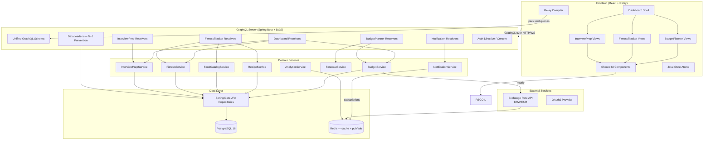
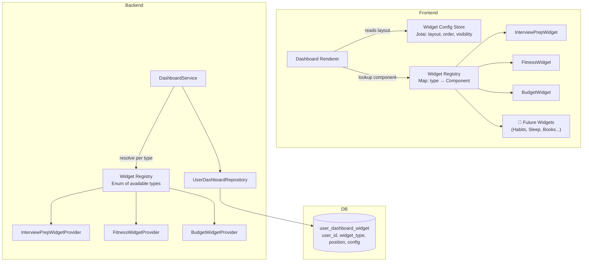
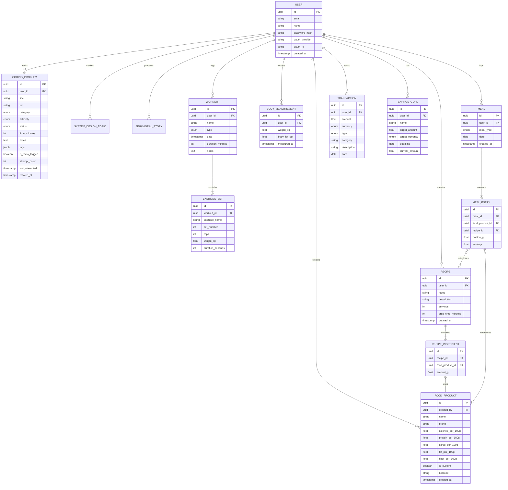
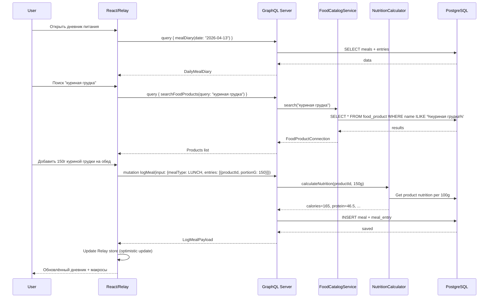
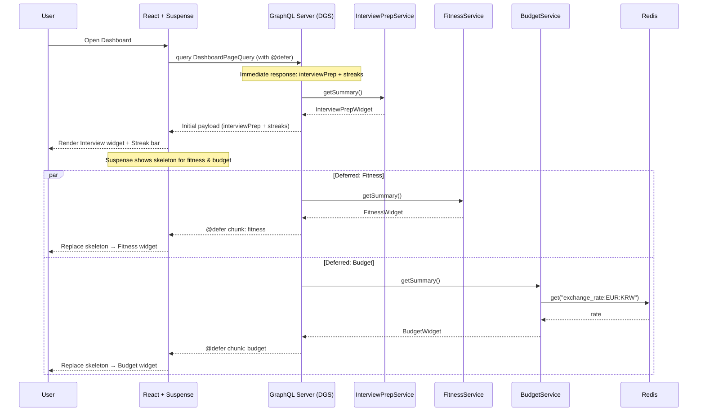
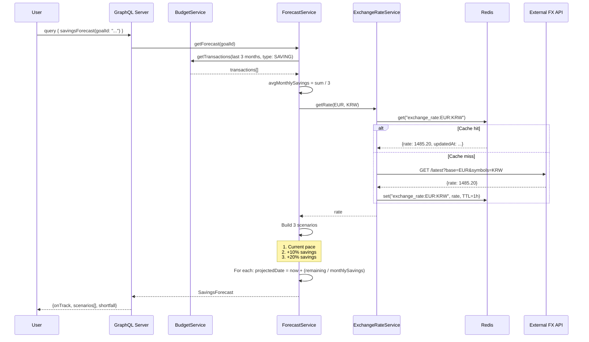
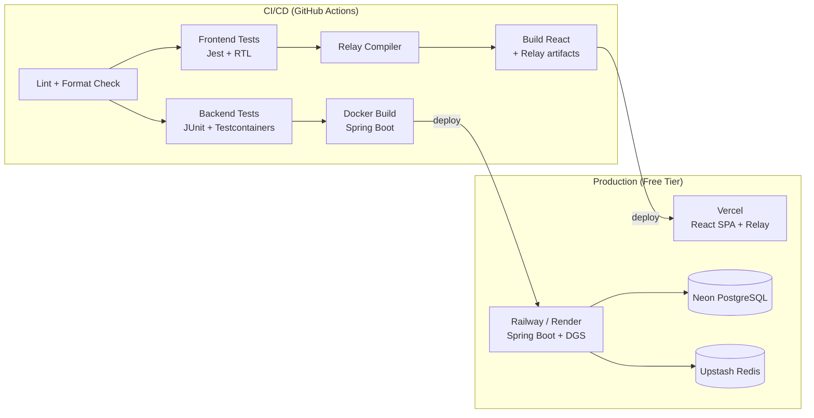

# Life Goals Dashboard — Architecture Design Document

[ARCHITECTURE.en.md](./ARCHITECTURE.en.md) · [ARCHITECTURE.md](./ARCHITECTURE.md)

---

> Автор: mrurec | Дата: April 2026
> Цель: Универсальная widget-платформа для трекинга любых жизненных целей. Портфолио-проект для FAANG-уровня собеседований.
> Стек: Kotlin/Spring Boot + GraphQL + React/Relay — выбран для максимального соответствия инженерным паттернам Meta

---

## 1. Обзор проекта

**Life Goals Dashboard** — универсальная widget-платформа для трекинга любых жизненных целей через динамический, конфигурируемый дашборд. Проект не привязан к конкретным целям — каждый пользователь сам выбирает какие виджеты добавить и настраивает их под себя. Архитектура и code style выстроены под стандарты Meta Engineering.

### Встроенные типы виджетов

| Тип виджета | Назначение | Ключевые фичи |
| --- | --- | --- |
| **Interview Prep** | Подготовка к техническим собеседованиям (компания и уровень — в конфиге) | Трекинг задач LeetCode, system design топики, behavioral STAR stories, аналитика слабых мест |
| **Fitness Tracker** | Трекинг физической формы (цели — в конфиге) | Тренировки, трекинг веса, **база продуктов и блюд**, дневник питания с макросами |
| **Budget Planner** | Накопления на любую цель (валюты, дедлайн — в конфиге) | Расходы/доходы, цель накопления, прогноз, курс обмена для конфигурируемой пары валют |

> **Пример:** пользователь может добавить Interview Prep с `targetCompany: "Google"`, два Budget Planner виджета (один для отпуска, один для emergency fund) с разными валютами и дедлайнами, и Fitness Tracker — всё на одном дашборде.

---

## 2. Принципы Meta Engineering, заложенные в проект

Каждый принцип ниже — это то, что интервьюер из Meta оценит при обсуждении проекта.

### 2.1 GraphQL + Relay: данные рядом с компонентом

Meta изобрела GraphQL и Relay. В проекте используется **Fragment Colocation** — каждый React-компонент объявляет свой GraphQL-фрагмент рядом с собой, а не в отдельном файле. Это гарантирует, что данные и представление никогда не расходятся.

### 2.2 Persisted Queries

На продакшене клиент не отправляет текст запроса — только хеш (MD5) + переменные. Это снижает bandwidth, даёт security (allowlist запросов на сервере) и предотвращает произвольные запросы.

### 2.3 Cursor-based Pagination (Relay Connection Pattern)

Везде, где есть списки, используется стандартный Relay Connection pattern: `edges → node + cursor`, `pageInfo { hasNextPage, endCursor }`. Никогда offset-based — это не масштабируется.

### 2.4 Privacy-Aware Data Access

Каждый запрос данных включает контекст viewer'а. Проверка прав — inline, не пост-фактум. Если viewer не имеет доступа, запрос не возвращает данные (а не скрывает строки после fetch).

### 2.5 React: Suspense + Error Boundaries

Async-рендеринг координируется через Suspense (fallback UI пока данные загружаются). Error Boundary оборачивает Suspense для отлова ошибок рендеринга. Вместе они дают graceful degradation.

### 2.6 Jotai для глобального state

Meta не использует Redux. Jotai — атомарный стейт, гранулярные подписки, минимальный boilerplate. Компоненты подписываются только на те атомы, которые им нужны. (Recoil — предыдущий вариант от Facebook — архивирован upstream и не поддерживает concurrent-рендеринг React 19; Jotai — его идейный преемник с той же моделью атомов.)

---

## 3. Требования

### 3.1 Функциональные требования

**Общие:**
- Единый дашборд с виджетами от каждого модуля
- GraphQL API с Relay-совместимой схемой
- Система нотификаций (in-app + GraphQL Subscriptions)
- Аутентификация (OAuth2 + JWT)
- Экспорт данных (CSV/PDF)

**Interview Prep:**
- CRUD задач с категориями (Arrays, Trees, Graphs, DP, System Design, Behavioral)
- Оценка сложности и время решения
- Тегирование задач (meta-tagged, повторить, не решил)
- Аналитика: решено по категориям, средняя скорость, heat map активности
- Таймер для практики

**Fitness Tracker:**
- Логирование тренировок (упражнение, подходы, повторения, вес)
- Трекинг массы тела с графиком
- **База продуктов**: каталог продуктов с нутриентами (на 100г), поиск, пользовательские продукты
- **Блюда / рецепты**: составные блюда из нескольких продуктов, с автоматическим подсчётом калорий/макросов
- Дневник питания: привязка продуктов или готовых блюд к приёмам пищи, указание порции
- Шаблоны тренировок
- Прогресс относительно целей (целевой вес, частота тренировок, калорийный дефицит)

**Budget Planner:**
- Трекинг доходов и расходов по категориям
- Цель накопления с прогресс-баром и пользовательским дедлайном (конфигурируется в widget config)
- Прогноз: успею ли накопить при текущем темпе
- Курс обмена для пары валют, заданной в конфигурации (например, KRW/EUR) через внешний API (с кешем в Redis)
- Бюджет поездки: перелёт, жильё, еда, развлечения — каждая статья в пользовательской валютной паре

### 3.2 Нефункциональные требования

| Параметр | Значение | Обоснование |
| --- | --- | --- |
| Доступность | 99.5% | Pet-project, но должен быть надёжным |
| Latency | < 200ms p95 для GraphQL queries | Приятный UX, @defer для тяжёлых полей |
| Масштабируемость | 1 пользователь → архитектура на 10K | Демонстрация мышления о scale на собесе |
| Безопасность | OAuth2 + JWT, persisted queries allowlist | Финансовые данные + Meta-паттерн |
| Развёртывание | Docker + CI/CD | DevOps-навыки |

---

## 4. Высокоуровневая архитектура

### 4.1 Архитектурный стиль: Modular Monolith

**Почему модульный монолит, а не микросервисы:**
- Один разработчик — overhead на инфраструктуру не оправдан
- Shared database упрощает транзакции между модулями
- Чёткие границы модулей позволяют позже разделить на сервисы

**Почему не простой монолит:**
- Каждый модуль имеет свой package, GraphQL-схему, и domain model
- Модули общаются через defined interfaces, не напрямую через репозитории друг друга
- На собесе можно обсудить эволюцию к сервисам и federation

### 4.2 Диаграмма компонентов



### 4.3 Структура проекта

#### Backend (Kotlin + Spring Boot + Netflix DGS)

```
apps/api/
├── src/main/kotlin/com/mrurec/lifegoals/
│   ├── LifeGoalsApplication.kt
│   ├── common/
│   │   ├── config/
│   │   │   ├── SecurityConfig.kt         # OAuth2 + JWT
│   │   │   ├── GraphQLConfig.kt          # DGS settings, persisted queries
│   │   │   ├── RedisConfig.kt
│   │   │   └── CorsConfig.kt
│   │   ├── auth/
│   │   │   ├── ViewerContext.kt           # Meta-style: viewer-aware context
│   │   │   ├── AuthDirective.kt           # @auth directive for schema
│   │   │   └── JwtTokenProvider.kt
│   │   ├── graphql/
│   │   │   ├── relay/
│   │   │   │   ├── Connection.kt          # Relay Connection types
│   │   │   │   ├── Edge.kt
│   │   │   │   ├── PageInfo.kt
│   │   │   │   └── CursorUtil.kt          # Cursor encode/decode
│   │   │   ├── DataLoaderRegistrar.kt     # N+1 prevention
│   │   │   └── ScalarTypes.kt             # DateTime, Money, etc.
│   │   ├── exception/
│   │   │   └── GraphQLExceptionHandler.kt
│   │   └── util/
│   │       ├── DateTimeUtil.kt
│   │       └── MoneyUtil.kt
│   │
│   ├── interviewprep/                     # Module 1
│   │   ├── model/
│   │   │   ├── CodingProblem.kt
│   │   │   ├── SystemDesignTopic.kt
│   │   │   └── BehavioralStory.kt
│   │   ├── repository/
│   │   │   ├── CodingProblemRepository.kt
│   │   │   ├── SystemDesignTopicRepository.kt
│   │   │   └── BehavioralStoryRepository.kt
│   │   ├── service/
│   │   │   ├── InterviewPrepService.kt
│   │   │   └── InterviewAnalyticsService.kt
│   │   └── graphql/
│   │       ├── InterviewPrepResolver.kt   # Queries
│   │       ├── InterviewPrepMutation.kt   # Mutations
│   │       └── InterviewPrepDataLoader.kt
│   │
│   ├── fitness/                           # Module 2
│   │   ├── model/
│   │   │   ├── Workout.kt
│   │   │   ├── ExerciseSet.kt
│   │   │   ├── BodyMeasurement.kt
│   │   │   ├── FoodProduct.kt            # Продукт из каталога
│   │   │   ├── Recipe.kt                 # Составное блюдо
│   │   │   ├── RecipeIngredient.kt       # Продукт + количество в рецепте
│   │   │   ├── Meal.kt                   # Приём пищи
│   │   │   └── MealEntry.kt             # Запись: продукт или блюдо + порция
│   │   ├── repository/
│   │   │   ├── WorkoutRepository.kt
│   │   │   ├── BodyMeasurementRepository.kt
│   │   │   ├── FoodProductRepository.kt
│   │   │   ├── RecipeRepository.kt
│   │   │   └── MealRepository.kt
│   │   ├── service/
│   │   │   ├── FitnessService.kt
│   │   │   ├── FoodCatalogService.kt     # CRUD + поиск продуктов
│   │   │   ├── RecipeService.kt          # CRUD блюд с авто-расчётом
│   │   │   └── NutritionCalculator.kt    # Подсчёт калорий/макросов
│   │   └── graphql/
│   │       ├── FitnessResolver.kt
│   │       ├── FitnessMutation.kt
│   │       ├── FoodCatalogResolver.kt
│   │       ├── FoodCatalogMutation.kt
│   │       └── FitnessDataLoader.kt
│   │
│   ├── budget/                            # Module 3
│   │   ├── model/
│   │   │   ├── Transaction.kt
│   │   │   ├── SavingsGoal.kt
│   │   │   └── TripBudgetItem.kt
│   │   ├── repository/
│   │   │   ├── TransactionRepository.kt
│   │   │   ├── SavingsGoalRepository.kt
│   │   │   └── TripBudgetItemRepository.kt
│   │   ├── service/
│   │   │   ├── BudgetService.kt
│   │   │   ├── ForecastService.kt
│   │   │   └── ExchangeRateService.kt    # Exchange rates (configurable pairs) with Redis cache
│   │   └── graphql/
│   │       ├── BudgetResolver.kt
│   │       ├── BudgetMutation.kt
│   │       └── BudgetDataLoader.kt
│   │
│   ├── dashboard/                         # Aggregation layer
│   │   ├── service/
│   │   │   └── DashboardService.kt
│   │   └── graphql/
│   │       └── DashboardResolver.kt
│   │
│   └── notification/
│       ├── model/
│       │   └── Notification.kt
│       ├── service/
│       │   ├── NotificationService.kt
│       │   └── AchievementChecker.kt
│       └── graphql/
│           ├── NotificationResolver.kt
│           └── NotificationSubscription.kt  # GraphQL Subscriptions via WebSocket
│
├── src/main/resources/
│   ├── schema/                            # GraphQL schema files
│   │   ├── schema.graphqls               # Root Query, Mutation, Subscription
│   │   ├── relay.graphqls                # Node interface, Connection types
│   │   ├── interviewprep.graphqls
│   │   ├── fitness.graphqls
│   │   ├── food.graphqls                 # Products + Recipes schema
│   │   ├── budget.graphqls
│   │   ├── dashboard.graphqls
│   │   └── notification.graphqls
│   ├── db/migration/                      # Flyway migrations
│   └── application.yml
│
└── src/test/kotlin/com/mrurec/lifegoals/  # Tests colocated by module
    ├── interviewprep/
    ├── fitness/
    ├── budget/
    └── common/
```

#### Frontend — Монорепо (npm workspaces)

Проект организован как npm workspace монорепо для поддержки web и будущего mobile без изменения существующих конфигов.

```
life-goals-dashboard/              # корень npm workspace
│
├── packages/
│   └── shared/                    # @life-goals/shared — кросс-платформенный код
│       ├── schema.graphql         # Единственный источник правды для всех relay.config.json
│       ├── package.json
│       ├── tsconfig.json
│       └── src/
│           ├── relay/             # Базовый сетевой слой (fetch-логика без платформ. зависим.)
│           ├── store/             # Jotai atoms: themeAtom, userAtom, notificationsAtom
│           ├── hooks/             # Платформ-агностичные хуки: useDebounce, usePersistedCallback
│           └── types/             # Общие TypeScript-интерфейсы домена
│
├── apps/web/                      # React + Vite веб-приложение
│   ├── relay.config.json          # schema: "../packages/shared/schema.graphql"
│   ├── src/
│   │   ├── index.tsx
│   │   ├── App.tsx
│   │   ├── relay/
│   │   │   ├── RelayEnvironment.ts      # Relay network + store config (web transport)
│   │   │   └── persistedQueries.json   # Hash → query mapping
│   │   │
│   │   ├── components/                  # Web UI компоненты (CSS Modules)
│   │   │   ├── Button/
│   │   │   │   ├── Button.tsx
│   │   │   │   ├── Button.module.css
│   │   │   │   └── Button.test.tsx      # Colocated test (Meta pattern)
│   │   │   ├── Card/
│   │   │   ├── ProgressBar/
│   │   │   ├── Chart/
│   │   │   ├── ErrorBoundary.tsx
│   │   │   └── SuspenseFallback.tsx
│   │   │
│   │   ├── features/
│   │   │   ├── dashboard/
│   │   │   │   ├── DashboardPage.tsx
│   │   │   │   ├── DashboardPage.test.tsx
│   │   │   │   ├── widgets/
│   │   │   │   │   ├── InterviewWidget.tsx   # Contains its own GraphQL fragment
│   │   │   │   │   ├── FitnessWidget.tsx
│   │   │   │   │   └── BudgetWidget.tsx
│   │   │   │   └── __generated__/            # Relay compiler output
│   │   │   │
│   │   │   ├── interviewPrep/
│   │   │   │   ├── ProblemList.tsx           # Fragment: ProblemList_problems
│   │   │   │   ├── ProblemDetail.tsx         # Fragment: ProblemDetail_problem
│   │   │   │   ├── ProblemForm.tsx
│   │   │   │   ├── StatsHeatMap.tsx
│   │   │   │   ├── WeakAreasChart.tsx
│   │   │   │   ├── Timer.tsx
│   │   │   │   └── __generated__/
│   │   │   │
│   │   │   ├── fitness/
│   │   │   │   ├── WorkoutLog.tsx
│   │   │   │   ├── WorkoutForm.tsx
│   │   │   │   ├── BodyProgress.tsx
│   │   │   │   ├── food/                     # Food sub-feature
│   │   │   │   │   ├── FoodSearch.tsx        # Поиск продуктов
│   │   │   │   │   ├── FoodProductCard.tsx   # Fragment: FoodProductCard_product
│   │   │   │   │   ├── AddCustomFood.tsx
│   │   │   │   │   ├── RecipeBuilder.tsx     # Конструктор блюд
│   │   │   │   │   ├── RecipeCard.tsx
│   │   │   │   │   └── __generated__/
│   │   │   │   ├── meals/
│   │   │   │   │   ├── MealDiary.tsx         # Дневник питания
│   │   │   │   │   ├── MealEntry.tsx
│   │   │   │   │   ├── DailySummary.tsx      # Сводка калорий/макросов за день
│   │   │   │   │   └── __generated__/
│   │   │   │   └── __generated__/
│   │   │   │
│   │   │   └── budget/
│   │   │       ├── TransactionList.tsx
│   │   │       ├── TransactionForm.tsx
│   │   │       ├── SavingsProgress.tsx
│   │   │       ├── ForecastChart.tsx
│   │   │       ├── ExchangeRateWidget.tsx    # Exchange rate display (configured currency pair)
│   │   │       ├── BudgetBreakdown.tsx       # Breakdown of savings goal budget (configurable)
│   │   │       └── __generated__/
│   │   │
│   │   └── __generated__/               # Relay compiler output (root-level)
│   │
│   ├── package.json                     # dep: "@life-goals/shared": "*"
│   ├── vite.config.ts
│   └── tsconfig.json
│
└── apps/mobile/                         # [ПЛАН] React Native приложение
    ├── relay.config.json                # schema: "../packages/shared/schema.graphql"
    ├── src/                             # RN компоненты (View/Text/StyleSheet)
    └── README.md
```

**Правило:** Платформ-специфичный код (CSS Modules, DOM APIs, StyleSheet, Metro config) — в пакете платформы. Кросс-платформенная логика — в `packages/shared`.

---

## 5. Widget System — Pluggable Dashboard Architecture

Дашборд — не фиксированная страница из трёх виджетов, а **динамическая панель**, куда пользователь добавляет и удаляет виджеты. Interview Prep, Fitness и Budget — просто первые три виджета из растущего каталога. Новые виджеты (привычки, сон, книги, язык) подключаются без изменения ядра.

### 5.1 Архитектура Widget Registry



### 5.2 Backend: WidgetProvider Interface (Open-Closed Principle)

Каждый новый виджет реализует один интерфейс. Регистрация — через Spring autowiring.

```kotlin
// common/widget/WidgetProvider.kt

interface WidgetProvider {
    /** Unique type identifier */
    val type: WidgetType

    /** Display metadata for the widget catalog */
    val metadata: WidgetMetadata

    /** JSON schema for this widget's configuration */
    val configSchema: JsonSchema

    /**
     * Validate widget config against schema.
     * Returns a list of validation errors (empty if valid).
     */
    fun validateConfig(config: JsonNode): List<ConfigError>

    /**
     * Resolve widget data for a given viewer.
     * Returns a GraphQL-serializable object.
     * Each provider returns its own type — the GraphQL union handles polymorphism.
     * Config is required — all domain-specific parameters come from config, not hardcoded.
     */
    fun resolve(viewerContext: ViewerContext, config: JsonNode): Any
}

data class WidgetMetadata(
    val displayName: String,
    val description: String,
    val icon: String,
    val defaultConfig: JsonNode? = null
)

enum class WidgetType {
    INTERVIEW_PREP,
    FITNESS,
    BUDGET,
    // Future:
    // HABITS,
    // SLEEP_TRACKER,
    // BOOK_LIST,
    // LANGUAGE_LEARNING
}

// interviewprep/widget/InterviewPrepWidgetProvider.kt
@Component
class InterviewPrepWidgetProvider(
    private val interviewPrepService: InterviewPrepService
) : WidgetProvider {

    override val type = WidgetType.INTERVIEW_PREP

    override val metadata = WidgetMetadata(
        displayName = "Interview Prep",
        description = "Track LeetCode problems, system design topics, and behavioral stories",
        icon = "code"
    )

    override val configSchema = JsonSchema("""
    {
        "type": "object",
        "properties": {
            "targetCompany": { "type": "string", "description": "Target company name (e.g., Meta, Google)" },
            "focusAreas": { "type": "array", "items": { "type": "string" } },
            "deadline": { "type": "string", "format": "date" }
        },
        "required": ["targetCompany"]
    }
    """.trimIndent())

    override fun validateConfig(config: JsonNode): List<ConfigError> {
        val errors = mutableListOf<ConfigError>()
        if (!config.has("targetCompany")) {
            errors.add(ConfigError("targetCompany", "Required field"))
        }
        return errors
    }

    override fun resolve(viewerContext: ViewerContext, config: JsonNode): InterviewPrepWidgetData {
        val targetCompany = config["targetCompany"].asText()
        return interviewPrepService.getWidgetSummary(viewerContext.userId, targetCompany)
    }
}
```

### 5.3 Widget Registry (auto-discovery)

```kotlin
// common/widget/WidgetRegistry.kt

@Component
class WidgetRegistry(providers: List<WidgetProvider>) {

    private val registry: Map<WidgetType, WidgetProvider> =
        providers.associateBy { it.type }

    fun getProvider(type: WidgetType): WidgetProvider =
        registry[type] ?: throw WidgetNotFoundException(type)

    fun getAvailableWidgets(): List<WidgetMetadata> =
        registry.values.map { it.metadata }

    fun resolve(type: WidgetType, viewer: ViewerContext, config: JsonNode): Any {
        val provider = getProvider(type)
        val errors = provider.validateConfig(config)
        if (errors.isNotEmpty()) {
            throw InvalidWidgetConfigException(type, errors)
        }
        return provider.resolve(viewer, config)
    }
}
```

### 5.4 User Dashboard Configuration (DB)

```sql
-- Flyway: V5__create_user_dashboard.sql

CREATE TABLE user_dashboard_widget (
    id          UUID PRIMARY KEY DEFAULT gen_random_uuid(),
    user_id     UUID NOT NULL REFERENCES "user"(id),
    widget_type VARCHAR(50) NOT NULL,        -- 'INTERVIEW_PREP', 'FITNESS', etc.
    position    INT NOT NULL DEFAULT 0,       -- Order on dashboard
    size        VARCHAR(10) DEFAULT 'MEDIUM', -- 'SMALL', 'MEDIUM', 'LARGE'
    config      JSONB NOT NULL,               -- Widget-specific user config (required; e.g., target weight, deadline, currency pair)
    is_visible  BOOLEAN DEFAULT true,
    created_at  TIMESTAMP DEFAULT NOW(),

    UNIQUE (user_id, widget_type)             -- One instance per type per user
);

CREATE INDEX idx_user_dashboard_user ON user_dashboard_widget(user_id, position);
```

### 5.5 Frontend: Dynamic Widget Rendering

```tsx
// features/dashboard/WidgetRegistry.ts

import { lazy, ComponentType } from 'react';

// Lazy-loaded widget components — only load what user has enabled
const widgetComponents: Record<string, () => Promise<{ default: ComponentType<any> }>> = {
  INTERVIEW_PREP: () => import('./widgets/InterviewPrepWidget'),
  FITNESS: () => import('./widgets/FitnessWidget'),
  BUDGET: () => import('./widgets/BudgetWidget'),
  // Future widgets register here — zero changes to Dashboard code
  // HABITS: () => import('./widgets/HabitsWidget'),
  // SLEEP_TRACKER: () => import('./widgets/SleepTrackerWidget'),
};

export function getWidgetComponent(type: string): ComponentType<any> | null {
  const loader = widgetComponents[type];
  if (!loader) return null;
  return lazy(loader);
}

export function getAvailableWidgetTypes(): string[] {
  return Object.keys(widgetComponents);
}
```

```tsx
// features/dashboard/DashboardPage.tsx

import { Suspense } from 'react';
import { useLazyLoadQuery, useMutation } from 'react-relay';
import { graphql } from 'relay-runtime';
import ErrorBoundary from '../../components/ErrorBoundary';
import { getWidgetComponent } from './WidgetRegistry';

const dashboardQuery = graphql`
  query DashboardPageQuery {
    myDashboard {
      widgets {
        id
        type
        position
        size
        config
        data {
          __typename
          ... on InterviewPrepWidgetData { ...InterviewPrepWidget_data }
          ... on FitnessWidgetData { ...FitnessWidget_data }
          ... on BudgetWidgetData { ...BudgetWidget_data }
        }
      }
    }
    availableWidgets {
      type
      displayName
      description
      icon
    }
  }
`;

export default function DashboardPage() {
  const { myDashboard, availableWidgets } = useLazyLoadQuery(dashboardQuery, {});

  return (
    <div className="dashboard">
      <div className="dashboard__grid">
        {myDashboard.widgets
          .sort((a, b) => a.position - b.position)
          .map(widget => {
            const WidgetComponent = getWidgetComponent(widget.type);
            if (!WidgetComponent) return null;

            return (
              <ErrorBoundary key={widget.id} fallback={<WidgetError type={widget.type} />}>
                <Suspense fallback={<WidgetSkeleton size={widget.size} />}>
                  <WidgetComponent data={widget.data} config={widget.config} />
                </Suspense>
              </ErrorBoundary>
            );
          })
        }
      </div>

      <AddWidgetButton availableWidgets={availableWidgets} />
    </div>
  );
}
```

### 5.6 Как добавить новый виджет (DX за 3 шага)

Добавить, например, **Sleep Tracker** виджет:

**Шаг 1. Backend** — создать `SleepWidgetProvider implements WidgetProvider` и модели. Spring autodiscovery подхватит его в `WidgetRegistry`.

**Шаг 2. GraphQL Schema** — добавить `SleepWidgetData` в union `WidgetData` и написать фрагмент.

**Шаг 3. Frontend** — создать `SleepWidget.tsx` с фрагментом и зарегистрировать в `widgetComponents` map (одна строка).

Ничего больше менять не нужно. Dashboard, resolvers, маршрутизация — всё работает автоматически. Это **Open-Closed Principle** в действии.

### 5.7 Темы для собеседования из Widget System

1. **"Design a plugin/widget system"** — прямое попадание. Обсуди: registry pattern, lazy loading, schema evolution (union vs interface)
2. **"How would you extend this?"** — "Добавление виджета = 1 provider + 1 component + 1 schema type. Ноль изменений в core."
3. **"How do you handle N widget types in GraphQL?"** — Union type `WidgetData` + `__typename` для dispatch. Trade-off: union требует явного перечисления типов vs interface позволяет open set но теряет type safety.

---

## 6. GraphQL Schema

### 5.1 Core Types & Relay Interface

```graphql
# schema.graphqls — Root types

interface Node {
  id: ID!
}

type PageInfo {
  hasNextPage: Boolean!
  hasPreviousPage: Boolean!
  startCursor: String
  endCursor: String
}

type Query {
  # Relay node interface — resolve any entity by global ID
  node(id: ID!): Node

  # Dashboard — dynamic widget system
  myDashboard: MyDashboard!
  availableWidgets: [AvailableWidget!]!

  # Interview Prep
  problems(
    first: Int
    after: String
    filter: ProblemFilter
  ): CodingProblemConnection!
  problem(id: ID!): CodingProblem
  interviewStats: InterviewStats!
  problemHeatMap(days: Int = 90): [HeatMapEntry!]!
  weakAreas: [WeakArea!]!

  systemDesignTopics: [SystemDesignTopic!]!
  behavioralStories: [BehavioralStory!]!

  # Fitness
  workouts(first: Int, after: String): WorkoutConnection!
  workout(id: ID!): Workout
  bodyMeasurements(first: Int, after: String): BodyMeasurementConnection!
  bodyProgress: BodyProgress!
  fitnessStats: FitnessStats!

  # Food & Recipes
  searchFoodProducts(query: String!, first: Int = 20): FoodProductConnection!
  foodProduct(id: ID!): FoodProduct
  myRecipes(first: Int, after: String): RecipeConnection!
  recipe(id: ID!): Recipe

  # Meals
  mealDiary(date: Date!): DailyMealDiary!
  dailyNutritionSummary(date: Date!): NutritionSummary!
  weeklyNutritionSummary: WeeklyNutritionSummary!

  # Budget
  transactions(
    first: Int
    after: String
    filter: TransactionFilter
  ): TransactionConnection!
  transactionSummary(period: Period!): TransactionSummary!
  savingsGoals: [SavingsGoal!]!
  savingsForecast(goalId: ID!): SavingsForecast!
  exchangeRate(from: Currency!, to: Currency!): ExchangeRate!
  savingGoalBudget: TripBudget!  # Budget breakdown for active savings goal (configured per widget)

  # Notifications
  notifications(first: Int, after: String, unreadOnly: Boolean): NotificationConnection!
}

type Mutation {
  # Interview Prep
  createProblem(input: CreateProblemInput!): CreateProblemPayload!
  updateProblem(input: UpdateProblemInput!): UpdateProblemPayload!
  deleteProblem(id: ID!): DeleteProblemPayload!
  logProblemAttempt(input: LogAttemptInput!): LogAttemptPayload!

  createSystemDesignTopic(input: CreateSystemDesignTopicInput!): CreateSystemDesignTopicPayload!
  updateSystemDesignTopic(input: UpdateSystemDesignTopicInput!): UpdateSystemDesignTopicPayload!

  createBehavioralStory(input: CreateBehavioralStoryInput!): CreateBehavioralStoryPayload!
  updateBehavioralStory(input: UpdateBehavioralStoryInput!): UpdateBehavioralStoryPayload!

  # Fitness
  logWorkout(input: LogWorkoutInput!): LogWorkoutPayload!
  updateWorkout(input: UpdateWorkoutInput!): UpdateWorkoutPayload!
  deleteWorkout(id: ID!): DeleteWorkoutPayload!

  recordBodyMeasurement(input: RecordBodyMeasurementInput!): RecordBodyMeasurementPayload!

  # Food & Recipes
  createFoodProduct(input: CreateFoodProductInput!): CreateFoodProductPayload!
  updateFoodProduct(input: UpdateFoodProductInput!): UpdateFoodProductPayload!
  createRecipe(input: CreateRecipeInput!): CreateRecipePayload!
  updateRecipe(input: UpdateRecipeInput!): UpdateRecipePayload!
  deleteRecipe(id: ID!): DeleteRecipePayload!

  # Meals
  logMeal(input: LogMealInput!): LogMealPayload!
  updateMealEntry(input: UpdateMealEntryInput!): UpdateMealEntryPayload!
  deleteMealEntry(id: ID!): DeleteMealEntryPayload!

  # Budget
  createTransaction(input: CreateTransactionInput!): CreateTransactionPayload!
  updateTransaction(input: UpdateTransactionInput!): UpdateTransactionPayload!
  deleteTransaction(id: ID!): DeleteTransactionPayload!
  createSavingsGoal(input: CreateSavingsGoalInput!): CreateSavingsGoalPayload!
  updateSavingsGoal(input: UpdateSavingsGoalInput!): UpdateSavingsGoalPayload!
  updateTripBudget(input: UpdateTripBudgetInput!): UpdateTripBudgetPayload!

  # Notifications
  markNotificationRead(id: ID!): MarkNotificationReadPayload!
  markAllNotificationsRead: MarkAllNotificationsReadPayload!
}

type Subscription {
  notificationReceived: Notification!
  exchangeRateUpdated(from: Currency!, to: Currency!): ExchangeRate!
}
```

### 5.2 Interview Prep Types

```graphql
# interviewprep.graphqls

type CodingProblem implements Node {
  id: ID!
  title: String!
  url: String
  category: ProblemCategory!
  difficulty: Difficulty!
  status: ProblemStatus!
  timeMinutes: Int
  notes: String
  tags: [String!]!
  isMetaTagged: Boolean!
  attemptCount: Int!
  lastAttempted: DateTime
  createdAt: DateTime!
}

type CodingProblemConnection {
  edges: [CodingProblemEdge!]!
  pageInfo: PageInfo!
  totalCount: Int!
}

type CodingProblemEdge {
  node: CodingProblem!
  cursor: String!
}

enum ProblemCategory {
  ARRAY
  STRING
  LINKED_LIST
  TREE
  GRAPH
  DYNAMIC_PROGRAMMING
  BINARY_SEARCH
  BACKTRACKING
  SYSTEM_DESIGN
  OTHER
}

enum Difficulty { EASY MEDIUM HARD }
enum ProblemStatus { TODO ATTEMPTED SOLVED REVIEW }

input ProblemFilter {
  category: ProblemCategory
  difficulty: Difficulty
  status: ProblemStatus
  isMetaTagged: Boolean
  searchQuery: String
}

input CreateProblemInput {
  title: String!
  url: String
  category: ProblemCategory!
  difficulty: Difficulty!
  timeMinutes: Int
  notes: String
  tags: [String!]
  isMetaTagged: Boolean = false
}

# Meta pattern: every mutation returns a Payload with the mutated object
type CreateProblemPayload {
  problem: CodingProblem!
}

input LogAttemptInput {
  problemId: ID!
  timeMinutes: Int!
  solved: Boolean!
  notes: String
}

type LogAttemptPayload {
  problem: CodingProblem!
}

type InterviewStats {
  totalProblems: Int!
  solvedCount: Int!
  attemptedCount: Int!
  solvedByCategory: [CategoryCount!]!
  solvedByDifficulty: [DifficultyCount!]!
  averageSolveTimeMinutes: Float
  streakDays: Int!
  metaTaggedSolved: Int!
  metaTaggedTotal: Int!
  readinessScore: Float!   # 0-100, heuristic
}

type CategoryCount {
  category: ProblemCategory!
  solved: Int!
  total: Int!
  percentage: Float!
}

type HeatMapEntry {
  date: Date!
  count: Int!
}

type WeakArea {
  category: ProblemCategory!
  solvedPercentage: Float!
  recommendation: String!
}

type SystemDesignTopic implements Node {
  id: ID!
  title: String!
  status: StudyStatus!
  keyPoints: String
  notes: String
  resources: [String!]!
  lastReviewed: DateTime
}

enum StudyStatus { NOT_STARTED IN_PROGRESS REVIEWED MASTERED }

type BehavioralStory implements Node {
  id: ID!
  situation: String!
  task: String!
  action: String!
  result: String!
  applicableQuestions: [String!]!
  confidence: Confidence!
}

enum Confidence { LOW MEDIUM HIGH }
```

### 5.3 Fitness & Food Types

```graphql
# fitness.graphqls

type Workout implements Node {
  id: ID!
  name: String!
  type: WorkoutType!
  date: DateTime!
  durationMinutes: Int!
  exerciseSets: [ExerciseSet!]!
  notes: String
  totalVolume: Float            # Computed: sum(sets * reps * weight)
}

type WorkoutConnection {
  edges: [WorkoutEdge!]!
  pageInfo: PageInfo!
  totalCount: Int!
}

type WorkoutEdge {
  node: Workout!
  cursor: String!
}

enum WorkoutType { STRENGTH CARDIO FLEXIBILITY MIXED }

type ExerciseSet {
  exerciseName: String!
  setNumber: Int!
  reps: Int
  weightKg: Float
  durationSeconds: Int
}

type BodyMeasurement implements Node {
  id: ID!
  weightKg: Float!
  bodyFatPct: Float
  waistCm: Float
  chestCm: Float
  armCm: Float
  measuredAt: DateTime!
}

type BodyMeasurementConnection {
  edges: [BodyMeasurementEdge!]!
  pageInfo: PageInfo!
}

type BodyMeasurementEdge {
  node: BodyMeasurement!
  cursor: String!
}

type BodyProgress {
  currentWeight: Float!
  targetWeight: Float!
  startWeight: Float!
  weightChange: Float!          # Negative = lost weight
  trend: TrendDirection!
  measurements: [BodyMeasurement!]!  # Last 30 entries for chart
}

enum TrendDirection { UP DOWN STABLE }

type FitnessStats {
  workoutsThisWeek: Int!
  targetWorkoutsPerWeek: Int!
  avgDailyCalories: Float
  calorieTarget: Float
  currentWeight: Float!
  weightTrend: TrendDirection!
  streakDays: Int!
}

# food.graphqls — Products & Recipes

type FoodProduct implements Node {
  id: ID!
  name: String!
  brand: String
  # Nutrition per 100g
  caloriesPer100g: Float!
  proteinPer100g: Float!
  carbsPer100g: Float!
  fatPer100g: Float!
  fiberPer100g: Float
  # Meta
  isCustom: Boolean!            # User-created vs from catalog
  barcode: String
  createdBy: ID
}

type FoodProductConnection {
  edges: [FoodProductEdge!]!
  pageInfo: PageInfo!
  totalCount: Int!
}

type FoodProductEdge {
  node: FoodProduct!
  cursor: String!
}

input CreateFoodProductInput {
  name: String!
  brand: String
  caloriesPer100g: Float!
  proteinPer100g: Float!
  carbsPer100g: Float!
  fatPer100g: Float!
  fiberPer100g: Float
  barcode: String
}

type Recipe implements Node {
  id: ID!
  name: String!
  description: String
  ingredients: [RecipeIngredient!]!
  totalWeightG: Float!          # Computed: sum of ingredient weights
  servings: Int!
  # Computed nutrition (per serving)
  caloriesPerServing: Float!
  proteinPerServing: Float!
  carbsPerServing: Float!
  fatPerServing: Float!
  # Computed nutrition (total)
  totalCalories: Float!
  prepTimeMinutes: Int
  createdAt: DateTime!
}

type RecipeConnection {
  edges: [RecipeEdge!]!
  pageInfo: PageInfo!
}

type RecipeEdge {
  node: Recipe!
  cursor: String!
}

type RecipeIngredient {
  product: FoodProduct!
  amountG: Float!
  # Computed from product nutrition * amount
  calories: Float!
  protein: Float!
  carbs: Float!
  fat: Float!
}

input CreateRecipeInput {
  name: String!
  description: String
  ingredients: [RecipeIngredientInput!]!
  servings: Int! = 1
  prepTimeMinutes: Int
}

input RecipeIngredientInput {
  productId: ID!
  amountG: Float!
}

# Meal diary

type DailyMealDiary {
  date: Date!
  meals: [Meal!]!
  totals: NutritionSummary!
}

type Meal implements Node {
  id: ID!
  mealType: MealType!
  date: DateTime!
  entries: [MealEntry!]!
  totalCalories: Float!
  totalProtein: Float!
  totalCarbs: Float!
  totalFat: Float!
}

enum MealType { BREAKFAST LUNCH DINNER SNACK }

type MealEntry implements Node {
  id: ID!
  # Union-like: either a product or a recipe
  foodProduct: FoodProduct
  recipe: Recipe
  portionG: Float             # Weight in grams (for products)
  servings: Float             # Number of servings (for recipes)
  # Computed
  calories: Float!
  protein: Float!
  carbs: Float!
  fat: Float!
}

input LogMealInput {
  mealType: MealType!
  date: Date!
  entries: [MealEntryInput!]!
}

input MealEntryInput {
  foodProductId: ID
  recipeId: ID
  portionG: Float
  servings: Float
}

type NutritionSummary {
  calories: Float!
  protein: Float!
  carbs: Float!
  fat: Float!
  fiber: Float
  calorieTarget: Float
  proteinTarget: Float
  carbsTarget: Float
  fatTarget: Float
  isOnTarget: Boolean!
}

type WeeklyNutritionSummary {
  days: [DailyNutritionEntry!]!
  averageCalories: Float!
  averageProtein: Float!
  averageCarbs: Float!
  averageFat: Float!
}

type DailyNutritionEntry {
  date: Date!
  calories: Float!
  protein: Float!
  carbs: Float!
  fat: Float!
}
```

### 5.4 Budget Types

```graphql
# budget.graphqls

type Transaction implements Node {
  id: ID!
  amount: Float!
  currency: Currency!
  type: TransactionType!
  category: String!
  description: String
  date: DateTime!
}

type TransactionConnection {
  edges: [TransactionEdge!]!
  pageInfo: PageInfo!
  totalCount: Int!
}

type TransactionEdge {
  node: Transaction!
  cursor: String!
}

enum TransactionType { INCOME EXPENSE SAVING }
enum Currency { EUR KRW USD RUB }

input TransactionFilter {
  type: TransactionType
  category: String
  dateFrom: Date
  dateTo: Date
  minAmount: Float
  maxAmount: Float
}

input CreateTransactionInput {
  amount: Float!
  currency: Currency!
  type: TransactionType!
  category: String!
  description: String
  date: Date!
}

type TransactionSummary {
  period: Period!
  totalIncome: Float!
  totalExpenses: Float!
  totalSavings: Float!
  netAmount: Float!
  byCategory: [CategoryAmount!]!
}

type CategoryAmount {
  category: String!
  amount: Float!
  percentage: Float!
}

enum Period { WEEK MONTH QUARTER YEAR }

type SavingsGoal implements Node {
  id: ID!
  name: String!
  targetAmount: Float!
  targetCurrency: Currency!
  currentAmount: Float!
  deadline: Date!
  progressPercentage: Float!
  onTrack: Boolean!
}

type SavingsForecast {
  goal: SavingsGoal!
  avgMonthlySavings: Float!
  projectedReachDate: Date
  onTrack: Boolean!
  shortfall: Float             # How much more needed if not on track
  scenarios: [ForecastScenario!]!
}

type ForecastScenario {
  name: String!                 # "Current pace", "10% more", "20% more"
  monthlySavings: Float!
  reachDate: Date
  onTrack: Boolean!
}

type ExchangeRate {
  from: Currency!
  to: Currency!
  rate: Float!
  updatedAt: DateTime!
}

type TripBudget {
  totalEur: Float!
  totalKrw: Float!
  items: [TripBudgetItem!]!
  currentRate: ExchangeRate!
  funded: Float!                # How much already saved
  remaining: Float!
}

type TripBudgetItem {
  id: ID!
  name: String!                 # "Flights", "Accommodation", "Food", etc.
  estimatedEur: Float!
  estimatedKrw: Float!          # Auto-converted at current rate
}
```

### 5.5 Dashboard & Notification Types

```graphql
# dashboard.graphqls — Dynamic Widget System

# User's configured dashboard
type MyDashboard {
  widgets: [DashboardWidget!]!
}

# A placed widget on the user's dashboard
type DashboardWidget implements Node {
  id: ID!
  type: WidgetType!
  position: Int!
  size: WidgetSize!
  config: JSON
  data: WidgetData! @defer     # Each widget data loads independently via @defer
}

enum WidgetType {
  INTERVIEW_PREP
  FITNESS
  BUDGET
  # Future: HABITS, SLEEP_TRACKER, BOOK_LIST, LANGUAGE_LEARNING
}

enum WidgetSize { SMALL MEDIUM LARGE }

# Union: each widget resolves its own data shape
union WidgetData =
  InterviewPrepWidgetData |
  FitnessWidgetData |
  BudgetWidgetData
  # Future types added here — clients use __typename to dispatch

# Widget catalog (what's available to add)
type AvailableWidget {
  type: WidgetType!
  displayName: String!
  description: String!
  icon: String!
}

type InterviewPrepWidgetData {
  solvedToday: Int!
  solvedThisWeek: Int!
  totalSolved: Int!
  weakestCategory: ProblemCategory
  readinessScore: Float!
  nextReviewProblem: CodingProblem   # Spaced repetition suggestion
}

type FitnessWidgetData {
  currentWeight: Float!
  weightTrend: TrendDirection!
  workoutsThisWeek: Int!
  todayCalories: Float
  todayCalorieTarget: Float
  lastWorkout: Workout
}

type BudgetWidgetData {
  savingsProgress: Float!       # Percentage toward goal (config-driven)
  monthlyBurnRate: Float!
  currentExchangeRate: Float!   # Exchange rate for configured currency pair (e.g., KRW/EUR)
  onTrack: Boolean!
  daysUntilDeadline: Int!       # Days until user-configured deadline
}

# Mutations for dashboard management
extend type Mutation {
  addWidgetToDashboard(input: AddWidgetInput!): AddWidgetPayload!
  removeWidgetFromDashboard(widgetId: ID!): RemoveWidgetPayload!
  reorderWidgets(input: ReorderWidgetsInput!): ReorderWidgetsPayload!
  updateWidgetConfig(input: UpdateWidgetConfigInput!): UpdateWidgetConfigPayload!
}

input AddWidgetInput {
  type: WidgetType!
  position: Int
  size: WidgetSize = MEDIUM
  config: JSON!                  # Widget-specific config (required; validated against widget's configSchema)
}

type AddWidgetPayload {
  widget: DashboardWidget
  errors: [UserError!]!
}

input ReorderWidgetsInput {
  widgetIds: [ID!]!             # Ordered list — position = index
}

type ReorderWidgetsPayload {
  dashboard: MyDashboard
  errors: [UserError!]!
}

type Streaks {
  coding: Int!                  # Days in a row solving problems
  workout: Int!                 # Days in a row logging workouts
  mealLogging: Int!             # Days in a row logging all meals
  budgetTracking: Int!          # Days in a row logging expenses
}

# notification.graphqls

type Notification implements Node {
  id: ID!
  title: String!
  message: String!
  type: NotificationType!
  isRead: Boolean!
  createdAt: DateTime!
  # Link to related entity
  relatedEntityId: ID
  relatedEntityType: String
}

enum NotificationType { REMINDER ACHIEVEMENT WARNING MILESTONE }

type NotificationConnection {
  edges: [NotificationEdge!]!
  pageInfo: PageInfo!
  unreadCount: Int!
}

type NotificationEdge {
  node: Notification!
  cursor: String!
}
```

---

## 6. Fragment Colocation (Meta Pattern)

Это ключевой паттерн — каждый React-компонент декларирует свои данные рядом с собой.

### Пример: FoodProductCard

```tsx
// features/fitness/food/FoodProductCard.tsx

import { useFragment } from 'react-relay';
import { graphql } from 'relay-runtime';
import type { FoodProductCard_product$key } from './__generated__/FoodProductCard_product.graphql';

// Fragment colocated with component — Meta pattern
const foodProductFragment = graphql`
  fragment FoodProductCard_product on FoodProduct {
    id
    name
    brand
    caloriesPer100g
    proteinPer100g
    carbsPer100g
    fatPer100g
    isCustom
  }
`;

interface Props {
  product: FoodProductCard_product$key;
  onSelect?: (id: string) => void;
}

export default function FoodProductCard({ product, onSelect }: Props) {
  const data = useFragment(foodProductFragment, product);

  return (
    <div className="food-product-card" onClick={() => onSelect?.(data.id)}>
      <div className="food-product-card__header">
        <span className="food-product-card__name">{data.name}</span>
        {data.brand && (
          <span className="food-product-card__brand">{data.brand}</span>
        )}
        {data.isCustom && (
          <span className="food-product-card__badge">Custom</span>
        )}
      </div>
      <div className="food-product-card__nutrition">
        <NutrientPill label="Cal" value={data.caloriesPer100g} unit="kcal" />
        <NutrientPill label="P" value={data.proteinPer100g} unit="g" />
        <NutrientPill label="C" value={data.carbsPer100g} unit="g" />
        <NutrientPill label="F" value={data.fatPer100g} unit="g" />
      </div>
      <span className="food-product-card__per">per 100g</span>
    </div>
  );
}
```

### Пример: RecipeBuilder (сложный компонент)

```tsx
// features/fitness/food/RecipeBuilder.tsx

import { useState, useCallback, Suspense } from 'react';
import { useMutation } from 'react-relay';
import { graphql } from 'relay-runtime';
import { useAtomValue } from 'jotai';
import FoodSearch from './FoodSearch';
import ErrorBoundary from '../../../components/ErrorBoundary';
import SuspenseFallback from '../../../components/SuspenseFallback';

const createRecipeMutation = graphql`
  mutation RecipeBuilderCreateMutation($input: CreateRecipeInput!) {
    createRecipe(input: $input) {
      recipe {
        id
        name
        caloriesPerServing
        proteinPerServing
        carbsPerServing
        fatPerServing
        totalCalories
        ingredients {
          product {
            name
          }
          amountG
          calories
          protein
        }
      }
    }
  }
`;

interface Ingredient {
  productId: string;
  productName: string;
  amountG: number;
  nutritionPer100g: { calories: number; protein: number; carbs: number; fat: number };
}

export default function RecipeBuilder() {
  const [name, setName] = useState('');
  const [servings, setServings] = useState(1);
  const [ingredients, setIngredients] = useState<Ingredient[]>([]);
  const [commit, isInFlight] = useMutation(createRecipeMutation);

  const handleAddIngredient = useCallback((product: any, amountG: number) => {
    setIngredients(prev => [...prev, {
      productId: product.id,
      productName: product.name,
      amountG,
      nutritionPer100g: {
        calories: product.caloriesPer100g,
        protein: product.proteinPer100g,
        carbs: product.carbsPer100g,
        fat: product.fatPer100g,
      },
    }]);
  }, []);

  // Real-time total computed on client
  const totals = ingredients.reduce(
    (acc, ing) => {
      const factor = ing.amountG / 100;
      return {
        calories: acc.calories + ing.nutritionPer100g.calories * factor,
        protein: acc.protein + ing.nutritionPer100g.protein * factor,
        carbs: acc.carbs + ing.nutritionPer100g.carbs * factor,
        fat: acc.fat + ing.nutritionPer100g.fat * factor,
      };
    },
    { calories: 0, protein: 0, carbs: 0, fat: 0 }
  );

  const handleSave = useCallback(() => {
    commit({
      variables: {
        input: {
          name,
          servings,
          ingredients: ingredients.map(i => ({
            productId: i.productId,
            amountG: i.amountG,
          })),
        },
      },
    });
  }, [commit, name, servings, ingredients]);

  return (
    <div className="recipe-builder">
      {/* ... name, servings inputs ... */}

      <ErrorBoundary fallback={<p>Failed to load food search</p>}>
        <Suspense fallback={<SuspenseFallback />}>
          <FoodSearch onSelect={handleAddIngredient} />
        </Suspense>
      </ErrorBoundary>

      {/* Ingredients list + real-time totals */}
      <div className="recipe-builder__totals">
        <span>Per serving: {(totals.calories / servings).toFixed(0)} kcal</span>
        <span>P: {(totals.protein / servings).toFixed(1)}g</span>
        <span>C: {(totals.carbs / servings).toFixed(1)}g</span>
        <span>F: {(totals.fat / servings).toFixed(1)}g</span>
      </div>

      <button onClick={handleSave} disabled={isInFlight}>
        Save Recipe
      </button>
    </div>
  );
}
```

### Пример: Dynamic Dashboard с Widget System

Полный пример динамического дашборда — см. **раздел 5.5** (Widget System → Frontend: Dynamic Widget Rendering). Каждый виджет загружается lazy, обёрнут в ErrorBoundary + Suspense, и данные подгружаются через @defer на уровне `DashboardWidget.data`.

---

## 7. ER-диаграмма (обновлённая)



---

## 8. Sequence Diagrams

### 8.1 Логирование приёма пищи (с поиском продуктов)



### 8.2 Dashboard: параллельная загрузка с @defer



### 8.3 Прогноз накоплений на поездку



---

## 9. DataLoaders — предотвращение N+1

Критически важная тема для собеседования. В GraphQL без DataLoaders каждый resolve field делает отдельный запрос к БД.

```kotlin
// common/graphql/DataLoaderRegistrar.kt

@Component
class DataLoaderRegistrar : DgsDataLoaderRegistryConsumer {

    @Autowired
    lateinit var foodProductRepository: FoodProductRepository

    override fun accept(registry: DataLoaderRegistry) {
        // Batch-загрузка продуктов по ID (для RecipeIngredient → FoodProduct)
        registry.register("foodProductLoader",
            DataLoaderFactory.newMappedDataLoader<UUID, FoodProduct> { ids ->
                CompletableFuture.supplyAsync {
                    foodProductRepository.findAllById(ids)
                        .associateBy { it.id }
                }
            }
        )

        // Batch-загрузка exercise sets по workout ID
        registry.register("exerciseSetLoader",
            DataLoaderFactory.newMappedDataLoader<UUID, List<ExerciseSet>> { workoutIds ->
                CompletableFuture.supplyAsync {
                    exerciseSetRepository.findByWorkoutIdIn(workoutIds)
                        .groupBy { it.workoutId }
                }
            }
        )
    }
}

// Использование в resolver:
@DgsData(parentType = "RecipeIngredient", field = "product")
fun product(dfe: DgsDataFetchingEnvironment): CompletableFuture<FoodProduct> {
    val loader = dfe.getDataLoader<UUID, FoodProduct>("foodProductLoader")
    val ingredient = dfe.getSource<RecipeIngredient>()
    return loader.load(ingredient.foodProductId)
}
```

**Что сказать на собесе:** "DataLoaders батчат запросы в рамках одного GraphQL-резолва. Если у рецепта 10 ингредиентов, без DataLoader — 10 запросов к food_product. С DataLoader — 1 запрос: `SELECT * FROM food_product WHERE id IN (...)`. Это аналог того, как работает TAO в Meta — батчинг и кеширование на уровне data access layer."

---

## 10. Code Style & Patterns (Meta-aligned)

### 10.1 Naming Conventions

| Элемент | Convention | Пример |
| --- | --- | --- |
| Kotlin class | UpperCamelCase | `FoodCatalogService` |
| Kotlin function | lowerCamelCase | `calculateNutrition()` |
| React component | UpperCamelCase | `FoodProductCard.tsx` |
| React hook | use-prefix | `useDebounce.ts` |
| GraphQL type | UpperCamelCase | `FoodProduct` |
| GraphQL field | lowerCamelCase | `caloriesPer100g` |
| GraphQL enum | SCREAMING_SNAKE | `DYNAMIC_PROGRAMMING` |
| Mutation input | `*Input` | `CreateRecipeInput` |
| Mutation result | `*Payload` | `CreateRecipePayload` |
| Fragment name | `ComponentName_fieldName` | `FoodProductCard_product` |

### 10.2 File Conventions

- Один экспорт на файл (компонент, хук, сервис)
- Тесты рядом с кодом: `FoodProductCard.test.tsx` в той же папке
- CSS Modules рядом с компонентом: `FoodProductCard.module.css`
- Максимальная вложенность директорий: 3 уровня
- `__generated__/` — артефакты Relay compiler, в `.gitignore` не добавляются (Meta-практика: коммитят generated types)

### 10.3 Testing Strategy (Meta E5 level)

```
Тесты называются: describe what + expect what

✓ "logMeal with valid product should calculate correct nutrition"
✓ "RecipeBuilder should update totals when ingredient is added"
✗ "test meal logging" (слишком расплывчато)
```

| Уровень | Инструмент | Покрытие |
| --- | --- | --- |
| Unit (services) | JUnit 5 + MockK | > 80% branch coverage |
| Integration (repositories) | Testcontainers + PostgreSQL | Critical paths |
| GraphQL resolvers | DGS test framework | All queries/mutations |
| React components | React Testing Library + Jest | Behavior assertions, not snapshots |
| E2E | Playwright | Critical user flows (log meal, log workout) |

### 10.4 Error Handling (Meta pattern)

```kotlin
// Errors as part of GraphQL response, not HTTP status codes

type CreateRecipePayload {
  recipe: Recipe
  errors: [UserError!]!    # Meta pattern: errors in payload
}

type UserError {
  field: String
  message: String!
  code: ErrorCode!
}

enum ErrorCode {
  NOT_FOUND
  VALIDATION_ERROR
  PERMISSION_DENIED
  RATE_LIMITED
}
```

---

## 11. Caching Strategy

| Данные | Хранение | TTL | Стратегия |
| --- | --- | --- | --- |
| Exchange rate (per active currency pair) | Redis | 1 hour | Cache-aside, refresh via scheduler |
| Dashboard summary | Redis | 5 min | Write-through invalidation |
| Problem stats & heat map | Redis | 10 min | Invalidate on problem CRUD |
| Food product search results | Redis | 30 min | Query-based key |
| Weekly nutrition summary | Redis | 15 min | Invalidate on meal log |
| Persisted queries map | In-memory | ∞ | Loaded at startup |

---

## 12. Trade-offs — готовые ответы для собеседования

### 12.1 GraphQL vs REST

**Выбрано: GraphQL**

"Я выбрал GraphQL потому что (1) дашборд агрегирует данные из трёх модулей — один запрос вместо трёх, (2) @defer позволяет отдавать критичные данные мгновенно, а тяжёлые — отложенно, (3) fragment colocation гарантирует, что компоненты запрашивают ровно те данные, которые рендерят — не больше, не меньше. Trade-off: кеширование сложнее чем HTTP cache для REST, поэтому я использую Relay store на клиенте и Redis на сервере. Ещё один trade-off — persisted queries добавляют build step, но дают security и bandwidth gains."

### 12.2 Modular Monolith → future Microservices

"Модули общаются через service interfaces. Если завтра Budget Planner станет отдельным сервисом, я заменю вызов `BudgetService.getSummary()` на GraphQL federation `@external` поле. Схема для клиента не меняется. Это осознанное решение: инвестировать в boundaries сейчас, чтобы не переписывать позже."

### 12.3 Computed fields на сервере vs клиенте

"Nutrition для RecipeBuilder считается на клиенте для instant feedback (UX), но при сохранении пересчитывается на сервере (source of truth). Это dual-write, но для некритичных данных (калории рецепта) это допустимый trade-off ради UX."

### 12.4 Netflix DGS vs graphql-java vs Spring for GraphQL

"DGS выбран потому что (1) production-proven в Netflix — масштаб сопоставим, (2) нативная поддержка DataLoaders, @defer, subscriptions, (3) code-first и schema-first оба работают, (4) интегрирован со Spring Boot. Trade-off: ещё одна зависимость, но она даёт federation-ready архитектуру."

### 12.5 Persisted Queries: security vs DX

"В продакшене клиент отправляет только hash запроса. Это предотвращает query injection и снижает payload size. Trade-off: каждое изменение запроса требует перегенерации хешей (build step). В dev-режиме persisted queries отключены для быстрой итерации."

---

## 13. Deployment



---

## 14. Resume-Worthy Enhancements

Фичи ниже превращают этот проект из "ещё одного трекера" в сильный пункт резюме для Meta E5. Каждая фича — это тема для deep dive на собеседовании.

### 14.1 GraphQL Subscriptions + Real-Time Dashboard

**Что:** Виджеты обновляются в реальном времени через WebSocket (GraphQL Subscriptions). Когда ты логируешь тренировку с телефона — дашборд на десктопе обновляется мгновенно.

**Почему это сильно для резюме:** Real-time data sync — один из самых частых system design вопросов. Ты можешь обсуждать: pub/sub через Redis, WebSocket management, fan-out strategies, reconnection/backoff.

```graphql
type Subscription {
  widgetUpdated(types: [WidgetType!]): DashboardWidget!
  notificationReceived: Notification!
}
```

### 14.2 Spaced Repetition Engine для задач LeetCode

**Что:** Вместо случайного выбора задач — алгоритм SM-2 (SuperMemo) рекомендует, какие задачи повторить сегодня. Задачи, которые ты решил медленно или с ошибкой, появляются чаще.

**Почему это сильно:** Показывает знание алгоритмов за пределами стандартных задач. Можно обсудить: scheduling algorithms, priority queues, trade-offs между SM-2 и Leitner system.

```kotlin
// interviewprep/service/SpacedRepetitionService.kt
data class ReviewSchedule(
    val problemId: UUID,
    val nextReviewDate: LocalDate,
    val easeFactor: Double,      // SM-2 ease factor (2.5 default)
    val interval: Int,           // Days until next review
    val repetitions: Int
)
```

### 14.3 Offline-First с Optimistic Updates

**Что:** Relay Store как local cache. Mutations применяются оптимистично (UI обновляется мгновенно), а синхронизация с сервером идёт в фоне. Если сервер недоступен — мутации складываются в очередь.

**Почему это сильно:** Offline-first — это то, как работают Instagram и Messenger (оба — Meta). Темы для обсуждения: conflict resolution, CRDT vs last-write-wins, optimistic UI patterns, retry with exponential backoff.

```tsx
// Optimistic update в Relay
const [commit] = useMutation(logWorkoutMutation);
commit({
  variables: { input },
  optimisticResponse: {
    logWorkout: {
      workout: { id: 'temp-id', ...input, __typename: 'Workout' }
    }
  },
  // Relay автоматически откатит, если сервер вернёт ошибку
});
```

### 14.4 Feature Flags System

**Что:** Простая система feature flags: JSON-файл (или БД-таблица), который контролирует доступность виджетов, UI-экспериментов, новых фич. Можно включать/выключать фичи без деплоя.

**Почему это сильно:** Meta живёт на feature flags (Gatekeeper). Это показывает, что ты думаешь об operations, gradual rollout, A/B testing. Тема для обсуждения: configuration management, dynamic config, percentage rollouts.

```kotlin
@Component
class FeatureFlags(
    @Value("\${features.config-path}") private val configPath: String
) {
    fun isEnabled(flag: String, userId: UUID? = null): Boolean
    fun getVariant(flag: String, userId: UUID): String  // For A/B tests
}
```

### 14.5 Structured Logging + Observability

**Что:** Каждый GraphQL-запрос логируется с: query hash, duration, resolver timings, DataLoader batch sizes, error rates. Визуализация через Grafana (или простой HTML-дашборд).

**Почему это сильно для E5:** Senior engineers владеют observability. Темы: structured logging (JSON), distributed tracing, p50/p95/p99 latencies, alerting thresholds. Показывает, что ты думаешь не только о "работает", но и о "как понять, что что-то идёт не так".

```kotlin
// GraphQL instrumentation
@Component
class QueryPerformanceInstrumentation : SimplePerformanceInstrumentation() {
    override fun instrumentQuery(query: String, variables: Map<String, Any>): QueryMetrics {
        return QueryMetrics(
            queryHash = md5(query),
            startTime = Instant.now(),
            resolverTimings = mutableMapOf(),
            dataLoaderBatchSizes = mutableMapOf()
        )
    }
}
```

### 14.6 Accessibility (a11y) — WCAG 2.1 AA

**Что:** Все компоненты проходят WCAG 2.1 AA: keyboard navigation, ARIA labels, focus management, color contrast, screen reader support.

**Почему:** Meta очень серьёзно относится к accessibility (2B+ пользователей). Это показывает product thinking и awareness на уровне senior. Тестируется через axe-core в CI.

### 14.7 Summary: что писать в резюме

```
Life Goals Dashboard — Full-stack modular application
• Built with React/Relay + Kotlin/Spring Boot + GraphQL (Netflix DGS)
• Designed pluggable widget architecture with dynamic dashboard composition
• Implemented Relay-style fragment colocation, persisted queries, @defer streaming
• Built real-time updates via GraphQL Subscriptions (Redis pub/sub + WebSocket)
• Integrated spaced repetition algorithm (SM-2) for interview prep optimization
• Achieved >80% test coverage with JUnit 5, Testcontainers, RTL, and Playwright
• Applied Meta engineering patterns: DataLoaders (N+1 prevention), viewer-aware
  privacy context, feature flags, structured observability logging
```

---

## 15. Roadmap (обновлённый)

### Фаза 1 — Foundation (Неделя 1-2)
- Spring Boot + DGS scaffolding, GraphQL schema (relay.graphqls, Node interface)
- React + Relay + Jotai setup, Relay compiler pipeline
- Docker Compose (PostgreSQL + Redis)
- Auth (JWT), ViewerContext (privacy-aware)
- Relay Connection utilities (cursor pagination)
- **Widget Registry** (backend WidgetProvider interface + frontend lazy registry)
- Dashboard layout persistence (user_dashboard_widget table)
- Feature Flags skeleton

### Фаза 2 — Interview Prep widget (Неделя 3-4)
- InterviewPrepWidgetProvider + GraphQL resolvers
- CRUD problems, system design topics, behavioral stories
- **Spaced Repetition engine (SM-2)** для рекомендаций
- Stats, heat map, weak areas
- Unit + integration тесты (>80% coverage)

### Фаза 3 — Fitness + Food widget (Неделя 5-7)
- FitnessWidgetProvider + GraphQL resolvers
- Workouts + body measurements
- **Food product catalog** (seed с 200+ продуктов)
- **Recipe builder** с авто-расчётом нутриентов
- Meal diary + daily/weekly summaries
- DataLoaders для N+1 prevention
- Fragment colocation для всех food компонентов

### Фаза 4 — Budget widget + Dynamic Dashboard (Неделя 8-9)
- BudgetWidgetProvider + GraphQL resolvers
- Transactions + savings goals
- Exchange rate integration (configurable currency pairs) + Redis cache
- Budget breakdown for user-configured savings goal (e.g., trip budget)
- Savings forecast with scenarios
- **Dynamic Dashboard**: add/remove/reorder widgets, @defer per widget
- Suspense + Error Boundaries per widget

### Фаза 5 — Resume-Worthy Polish (Неделя 10-11)
- **GraphQL Subscriptions** (real-time widget updates)
- **Optimistic updates** в Relay
- **Persisted queries** pipeline
- **Structured logging** + query performance instrumentation
- **Accessibility** audit (axe-core в CI)
- CI/CD pipeline (GitHub Actions)
- Deploy на free tier (Vercel + Railway + Neon + Upstash)
- Playwright E2E tests
- GraphQL Playground + README

### Фаза 6 — Mobile App (Будущее)
- Создать `apps/mobile/` как React Native проект
- Добавить `"apps/mobile"` в массив `workspaces` корневого `package.json` — единственное изменение существующих файлов
- `relay.config.json` → schema: `../packages/shared/schema.graphql` (уже готово)
- Подключить `@life-goals/shared` → получить atoms, хуки и типы бесплатно
- Реализовать `RelayEnvironment.ts` с React Native fetch transport
- Заменить CSS Modules на NativeWind или StyleSheet API
- Добавить React Navigation вместо React Router DOM
- Всё, что уже написано в `packages/shared`, работает сразу без изменений

---

## 15. Developer Onboarding & TDD Backlog

Проект включает полноценную систему онбординга для новых разработчиков:

**17-модульный интенсив-план** ([ONBOARDING_LEARNING_PLAN.md](./ONBOARDING_LEARNING_PLAN.md)) — от Git и TypeScript до Netflix DGS и Relay, с теорией привязанной к проекту.

**Интерактивные HTML study plans** ([index.html](./study-plans/index.html)) — 17 отдельных страниц с подсветкой синтаксиса, навигацией и прогресс-баром.

**TDD-задания из бэклога** — все 91 GitHub Issue из [BACKLOG.md](./BACKLOG.md) (7 milestones, включая M7 — Budget Accounts Aggregation) интегрированы в study plans как практические задания. На [`study-plans/index.html`](./study-plans/index.html) есть per-milestone mapping-блоки (M1–M7), показывающие какие задачи привязаны к каким учебным модулям. Для каждой задачи предоставлены готовые тесты (JUnit 5 + MockK для backend, Jest + React Testing Library для frontend), которые junior-разработчик должен сделать зелёными, написав реализацию. Это обеспечивает:

- **Практичность** — задания не абстрактные, а из реального проекта
- **Качество** — тесты задают ожидаемое поведение и API-контракты
- **Процесс** — TDD-подход формирует правильные привычки с первого дня
- **Покрытие** — после прохождения плана проект покрыт тестами >80%

---

## 16. Tech Stack Summary

| Layer | Technology | Meta Relevance |
| --- | --- | --- |
| **API** | GraphQL (Netflix DGS 11.1) | Meta invented GraphQL |
| **Frontend** | React 19.2 + TypeScript 6.0 | Meta's primary UI framework; Server Components, Actions, Activity API stable |
| **Data Fetching** | Relay (react-relay 20.1) | Meta's GraphQL client |
| **State** | Jotai 2.x | Atom-based successor to Recoil (Recoil is archived; Jotai is fully compatible with React 19 concurrent rendering) |
| **Backend** | Kotlin 2.3.20 + Spring Boot 4.0.5 (Spring Framework 7, Jakarta EE 11, Jackson 3, JSpecify) on JDK 25 LTS | Solid, demonstrates JVM expertise |
| **Database** | PostgreSQL 18.3 (async I/O, `uuidv7()`, virtual generated columns) | ACID, analytics, JSONB |
| **Cache** | Redis 8.6 | Caching, pub/sub for subscriptions |
| **ORM** | Spring Data JPA + Hibernate 7 | Standard |
| **Migration** | Flyway 11 | Schema versioning |
| **Build** | Gradle 9.4 (Kotlin DSL) | Reproducible builds, Java 26 support |
| **Bundler** | Vite 8 (Rolldown/Rust) | 10-30× faster builds than esbuild/Webpack |
| **Testing** | JUnit 5 + Testcontainers + RTL + Playwright | Full pyramid |
| **CI/CD** | GitHub Actions + Docker | Industry standard |
